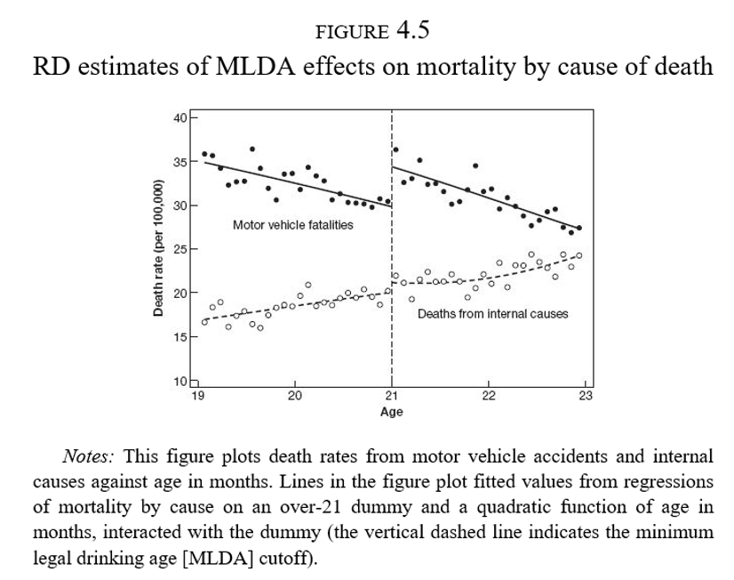
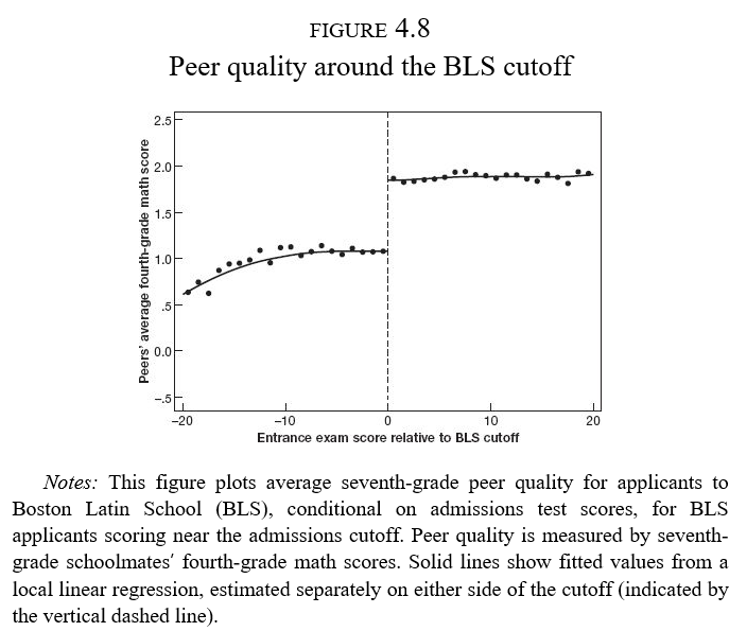
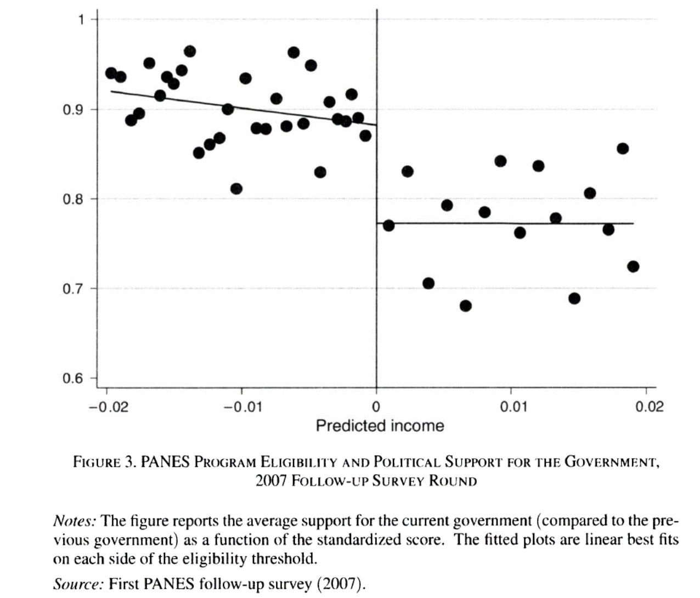
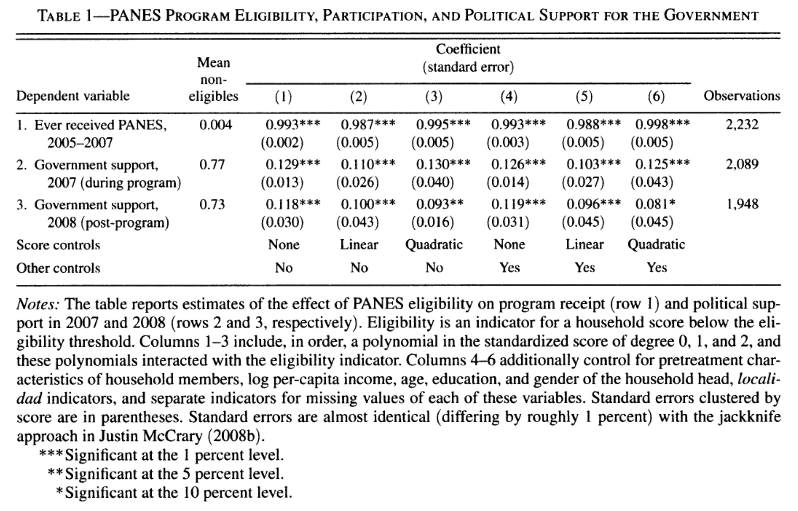
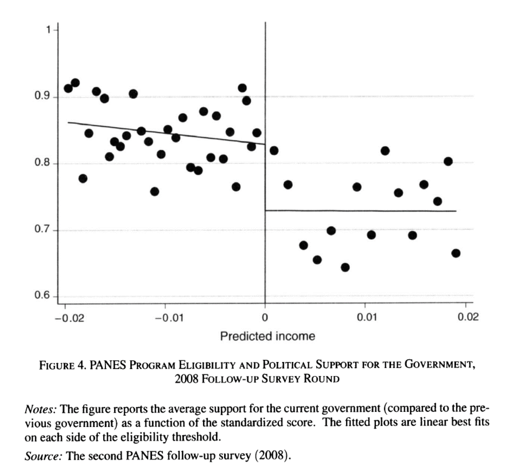
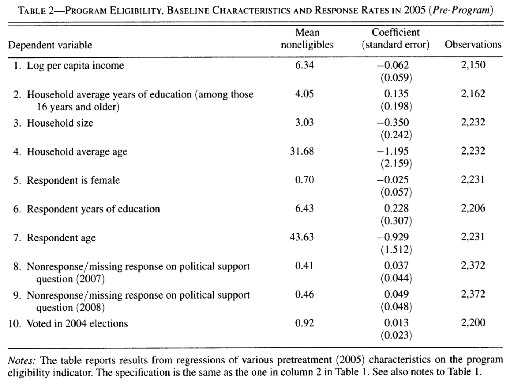

---
format:
  revealjs:
    theme: ["./theme-ic.scss"]
    width: 1600
    height: 900
    slide-number: c/t
    center: false
    scrollable: false
    title-slide: false
    logo: logo-CIDE.jpg
    footer: "Inferencia Causal · Diseños con discontinuidades"
    include-in-header:
      - _ic-header.html
      - fontawesome.html
---


```{r setup, include=FALSE}
knitr::opts_chunk$set(echo = FALSE, fig.path = "figures/")

library(tidyverse)
library(janitor)
library(sandwich)
#library(nnet)
library(readr)
library(clubSandwich)
library(modelsummary)
library(estimatr)
library(lubridate)
library(lfe)
library(modelsummary)
library(estimatr)


xfun::pkg_load2(c('base64enc', 'htmltools', 'mime'))
```


# Diseños con discontinuidades {.portada background-color="#163D34" data-state="nochrome"}

::: {.pa-eyebrow}
Inferencia Causal
:::

[Irvin Rojas]{.pa-name} <span class="pa-icons"><a href="https://github.com/rojasirvin" target="_blank" aria-label="GitHub"><i class="bi bi-github"></i></a> <a href="https://scholar.google.com/citations?hl=es&user=FUwdSTMAAAAJ&view_op=list_works&sortby=pubdate" target="_blank" aria-label="Google Scholar"><i class="bi bi-mortarboard-fill"></i></a> <a href="mailto:irvin.rojas@cide.edu" aria-label="Correo"><i class="bi bi-envelope-fill"></i></a></span>

::: {.pa-inst}
Centro de Investigación y Docencia Económicas<br>Maestría en Economía
:::
```{css, echo = FALSE}
.huge .remark-code { /*Change made here*/
  font-size: 200% !important;
}
.tiny .remark-code { /*Change made here*/
  font-size: 60% !important;
}
```


# Diseños con discontinuidades {.divider background-color="#9B2247" data-state="nochrome"}

	 
## Ejemplo: edad legal para tomar en EU


:::: {.columns}

::: {.column width="50%"}
- En Estados Unidos la edad legal para tomar es de 21 años
 
- ¿Por qué tenemos una ley para prohibir el consumo de alcohol antes de los 21 (o 18) años?
 
- La ley genera una discontinuidad en el acceso a alcohol justo a los 21 años
 
- Podemos evaluar la efectividad de la política
:::

::: {.column width="50%"}
```{r}
#| echo: false
knitr::include_graphics("birthdays_funerals.png",
                        dpi = 10)
```
:::

::::

 

## ¿Qué pasa en el cumpleaños 21?


:::: {.columns}

::: {.column width="50%"}
- ¿Efecto fiesta?
 
- Hay una tendendencia a la baja a ambos lados de la discotinuidad
 
- Sin embargo, hay un claro salto en el número de muertes a los 21 años
:::

::: {.column width="50%"}
```{r}
#| echo: false
knitr::include_graphics("alcohol_sharpRD.png",
                        dpi = 10)
```
:::

::::


# Discontinuidades nítidas {.divider background-color="#9B2247" data-state="nochrome"}

## Discontinuidades nítidas
 
- $D_a$ es el estado del tratamiento

$$
D_a =
\begin{cases}
1  & \text{si } a \geq 21 \\
0  & \text{si } a < 21
\end{cases}
$$
	 
- $a$ es conocida como *running variable*, *score*, variable de selección, variable de asignación, etc.
 
- El tratamiento es una función determinística de $a$

  - Si conocemos $a$ entonces conocemos $D_a$
 
- El tratamiento es discontinuo sobre $a$

  - No importa qué tanto nos acercamos al corte, el estatus de tratamiento es el mismo hasta $a$
 

## Discontinuidades nítidas y regresión
 
- Muchas cosas cambian con la edad

- Riesgo de enfermedades, muerte por otras causas

- Usamos regresión para aislar los efectos de la regla

$$
\bar{M}_a=\alpha+\rho D_a + \gamma a + \epsilon_a
$$

- $\bar{M}_a$ es la tasa de mortalidad en el mes $a$

- $\rho$ captura el salto en la mortalidad a los 21 años

- $\hat{\rho}=7.66$ : número de muertes adicionales a los 21 años
	
 
## Diferencia con otros diseños
 
- A diferencia de los métodos de regresión o pareamiento donde controlamos por un vector $X$ y esperamos que el tratamiento sea aleatorio controlando por $X$
 
- Aquí no hay valores de $a$ para los que observemos individuos en ambos estados del tratamiento
 
- La interpretación de la RD es en la vecindad de la discontinuidad
 
## No linealidad vs discontinuidad


:::: {.columns}

::: {.column width="50%"}
- Estimar el modelo de RD cuando la relación entre $E[Y|X]$ es como en el tercer panel nos llevaría a inferir un salto donde no existe
 
- Al usar RD debemos asegurarnos que estamos identificando una discontinuidad
 
  - Modelar la no linealidad (enfoque *antiguo*)
  
  - Concentrarnos solo en una ventana cercana a $a_0$ (enfoque más *moderno*)
:::

::: {.column width="50%"}
```{r }
#| echo: FALSE
knitr::include_graphics("discontinuity_nonlinearity.png",
                        dpi = 5)
```
:::

::::


## No linealidades
 
- Podemos usar polinomios de $a$

- Idealmente, las conclusiones no deberían cambiar de acuerdo al grado del polinomio usado

- El consejo es intentar varias especificaciones y no solo la que se ajuste más a nuestras expectativas de los resultados

- La Figura 4.2 parece tener una leve curvatura a la derecha de $a$

- Podemos ajustar directamente un polinomio de la edad:

$$
\bar{M}_a=\alpha+\rho D_a + \gamma_1 a + \gamma_2 a^2 + \epsilon_a
$$


## No linealidades

- O podemos espcificar un coeficiente diferente para $a$ antes y después de $a_0$:


$$
\bar{M}_a=\alpha+\rho D_a + \gamma(a-a_0) + \delta[(a-a_0)D_a] + \epsilon_a
$$

- Notemos que en este caso el efecto del tratamiento es:
 
$$
\rho+\delta(a-a_0)
$$


- Es decir, un efecto que depende de la distancia con $a_0$

- Sin embargo, ¿qué tan válido es evaluar el efecto en, digamos, $a=30$? ¿O en $a=10$?

## No linealidades

- Podemos emplear una combinación de no linealidades y cambios en pendiente:

$$
\begin{aligned}
\bar{M}_a&=\alpha+\rho D_a + \gamma_1(a-a_0) +\gamma_2(a-a_0)^2+\delta_1[(a-a_0)D_a]+ \delta_2[(a-a_0)^2D_a] + \epsilon_a
\end{aligned}
$$

- En esta especificación los términos lineal y cuadrático cambian en $a_0$

- Y el efecto del tratamiento en este caso es:


- Notemos que en este caso el efecto del tratamiento es:

$$
\rho+\delta_1(a-a_0)+\delta_2(a-a_0)^2
$$


- En los dos casos anteriores, regularmente se interpreta solo a $\rho$ como el efecto del tratamiento
 
  
## No linealidades


:::: {.columns}

::: {.column width="50%"}
- $\hat{\rho}=9.55$
 
- Modelo más elaborado con mejor ajuste
 
- Es evidente gráficamente que hay un salto a los 21 años y una caída suave después
 
- ¿Qué tan robustos son los resultados?
:::

::: {.column width="50%"}
```{r}
#| echo: FALSE
#| #| fig-align: center

knitr::include_graphics("alcohol_sharp_flexible.png",
                        dpi = 10)
```
:::

::::


## Efectos estimados

```{r}
#| echo: FALSE
#| fig-align: center
knitr::include_graphics("RDestimates.png",
                        dpi = 10)
```


## Efectos estimados

```{r}
#| echo: FALSE
#| fig-align: center

```


## Discontinuidades nítidas: resumen
 
- RD nítida se usa cuando el tratamiento es una función determinística de una variable $x$


$$
D_i =
\begin{cases}
1  & \mbox{if } x_i \geq x_0 \\
0  & \mbox{if } x_i < x_0
\end{cases}
$$


- $x_0$ es el *umbral* o *corte*

- $D_i$ es una función determinística de $x_i$ pues una vez que conocemos $x_i$ entonces conocemos $D_i$

- $D_i$ es una función discontinua en $x_i$ pues no importa que tanto nos acerquemos por la izquierda o por la derecha a $x_0$, el estado del tratamiento no cambia
	
## Discontinuidades nítidas: resumen
 
- A diferencia de los modelos de regresión o de pareamiento, no hay valor de $x_i$ en el que observemos a individuos tratados y no tratados
 
- La interpretación del efecto estimado por RD es un efecto local en la vecindad de $x_0$, donde podemos tener confianza que los individuos tratados y no tratados son similares en todas las dimensiones excepto en su posición respecto a $x_0$
 
- Una especificación flexible permite no confundir una discontinuidad con una no linealidad
 
- En la práctica, el polinomio de $x_i$ puede ser tan complejo como se desee pero se espera que los resultados no sean muy sensibles a especificaciones de este
 
- El método no paramétrico consiste en la estimación de $\rho$ en vecindades cada vez más pequeñas alrededor de $x_0$


# Discontinuidades difusas {.divider background-color="#9B2247" data-state="nochrome"}


## La ilusión de la élite
 
- Escuelas de élite, *exam schools*, altamente competitivas en Nueva York y Boston
 
- Bajas tasas de admisión
 
- ¿Cómo diferenciar el valor agregado de la escuela del hecho de que la acta selectividad hace que a estas escuelas asistan solo los alumnos más brillantes?
 
- ¡Ojalá pudiéramos asignar alumnos al azar!
 
- Los estudiantes en estas escuelas de élite comparten clases con estudiantes aventajados
 
 


## La regla de asignación

:::: {.columns}

::: {.column width = "50%"}

- Cada escuela tiene un *corte* de puntaje de admisión
 
- En la escuela más competitiva de Boston aquellos estudiantes debajo del corte nunca asisten a dicha escuela
 
- Los que están arriba del corte casi siempre acaban en la BLS
:::

::: {.column width = "50%"}

```{r}
#| echo: FALSE
#| fig-align: center
knitr::include_graphics("figures/RDfuzzy_enrollment_BLS.png",
                        dpi = 15)
```

:::

::::


## La regla de asignación 

:::: {.columns}

::: {.column width = "50%"}

- Sin embargo, aquellos que no alcanzan el puntaje mínimo de la BLS acaban de cualquier forma en una escuela de élite

:::

::: {.column width = "50%"}

```{r}
#| echo: FALSE
#| fig-align: center
knitr::include_graphics("figures/RDfuzzy_enrollment_any.png",
                        dpi = 15)
```

:::

::::


## La regla de asignación

:::: {.columns}

::: {.column width = "50%"}

- Hay una dimensión que genera una discontinuidad: efectos de pares o *peer effects*
 
- Es una de las preocupaciones más importantes de política educativa en casi cualquier país
 
- Tener buenos (malos) compañeros afecta los resultados del individuo $i$
 
- Quienes ingresan a la BLS (séptimo grado) tuvieron compañeros con mejor desempeño en matemáticas cuando iban en cuarto grado
:::

::: {.column width = "50%"}
```{r}
#| echo: FALSE
#| fig-align: center
knitr::include_graphics("figures/RDfuzzy_enrollment_peers.png",
                        dpi = 15)
```

:::

::::


## Modelo de efectos de pares
 
- Un modelo de efectos de pares:
 
 
$$Y_i=\theta_0+\theta_1\bar{X}_{(i)}+\theta_2 X_i + u_i$$
 
 
- $Y_i$ es el resultado de un examen de matemáticas en el séptimo año del individuo $i$
 
- $X_i$ es el resultado de un examen de matemáticas en el cuarto año del individuo $i$
 
- $\bar{X}_{(i)}$ es el resultado promedio de un examen de matemáticas en el cuarto año de los compañeros de $i$ sin incluir $i$
 
- Otra notación en la literatura escribe esto como $\bar{X}_{(-i)}$
 
- Los resultados están estandarizados por lo que los coeficientes se interpretan en términos de desviaciones estándar: $\hat{\theta}_1=0.25\sigma$
 


## RD difuso + VI
 
- Problemas
 
  - Sabemos que en la discontinuidad, la calidad de los pares cambia drásticamente
   
  - Características de los hogares (habilidad de los padres)
   
  - Doble causalidad: $i$ afecta a $j$ pero $j$ afecta a $i$ a la vez
		 

::: {.fragment}

- Variables instrumentales:
 
   
  - Queremos conocer el efecto de la calidad de los pares en el desempeño de matemáticas
   
  - Usamos el corte mínimo para ser aceptado en BLS como instrumento de la calidad de los pares
		 
:::


## Forma reducida


:::: {.columns}

::: {.column width = "50%"}

- Si solo usamos el corte para ser aceptado en BLS:
	 
 
$$Y_i=\alpha_0+\rho D_i + \beta_0 R_i + \epsilon_i$$
 
 
- Se obtiene $\hat{\rho}=-0.02$, $s.e.=0.10$
 
- Este es un modelo de forma reducida (variable de interés en función de la posición respecto al corte)
 
- Es el efecto causal de estar antes o después del corte
:::

::: {.column width = "50%"}

```{r}
#| echo: FALSE
#| fig-align: center
knitr::include_graphics("figures/RDfuzzy_reducedform.png",
                        dpi = 15)
```
:::
::::


## Modelo de VI
 
- Modelo estructural:
 
 
$$Y_i=\alpha_2+\lambda \bar{X}_{(i)} + \beta_2 R_i + \epsilon_{2i}$$
 
 
- Con una primera etapa
 
	 
$$\bar{X}_{(i)}=\alpha_1 + \phi D_i + \beta_1 R_i + \epsilon_{1i}$$
 
 
- En la primera etapa $\hat{\phi}=0.80\sigma$, como lo habíamos visto ya en la Figura 4.8
  
- En la segunda etapa $\hat{\lambda}=-0.023$, $(s.e.=0.13)$
 


## Modelo de VI

```{r}
#| echo: FALSE
#| fig-align: center

```


## La ilusión

- No hay tal ganancia por compartir clase con alumnos *brillantes*

- La gente sigue percibiendo que sus hijos ganan al ir a escuelas de élite

- Posiblemente los egresados de estas escuelas tengan mayores ingresos

- Las ganancias que se puedan obtener no son vía el efecto de pares o un mejor rendimiento cognitivo


## RD difusa: resumen
 
- RD difusa explota discontinuidades en la probabilidad o valor esperado del tratamiento condicional en una variable

- El resultado es que la discontinuidad se convierte en una VI para el estado del tratamiento en vez de una variable que se prende y apaga

$$
P(D_i =1|x_i)=
\begin{cases}
g_1(x_i)  & \mbox{if } x_i \geq x_0 \\
g_0(x_i)  & \mbox{if } x_i < x_0
\end{cases}
$$

- Las funciones $g_0$ u $g_1$ difieren en $x_0$

- Supongamos que $g_1(x_0)>g_0(x_0)$, es decir, $x_i\geq x_0$ hace el tratamiento más probable


## RD difusa: resumen

- La relación entre el estado de tratamiento y $x_i$ puede ser escrita como:

$$E(D_i|x_i)=P(D_i=1|x_i)=g_0(x_i)+[g_1(x_i)-g_0(x_i)]T_i$$

con $T_i=\mathcal{I}(x_i\geq x_0)$

- Escribiendo las funciones $g_0$ y $g_1$ como polinomios flexibles de $x_i$

$$E(D_i|x_i)=\gamma_{00}+\gamma_{01}x_i+\gamma_{02}x_i+\ldots+\gamma_{0p}x_i^p +\pi T_i + \gamma_{1}^{*}x_i T_i+ \gamma_{2}^{*}x_i^2 T_i+\ldots+ \gamma_{p}^{*}x_i^p T_i$$


## RD difusa: resumen
 
- En la primera etapa podríamos usar $\{x_iTi, x_i^2 T_i,...,x_i^p T_i\}$ como instrumentos para $D_i$

- Una primera etapa con interacciones sugeriría emplear una segunda etapa también con interacciones

- La versión más simple solo usa $T_i$ como instrumento

- La primera etapa será

$$D_i=\gamma_0+\gamma_1 x_i + \gamma_2 x_i^2 + \ldots + \gamma_p x_i^p + \rho T_i + \xi_{i}$$


- La forma reducida o ITT de este modelo es:

$$y_i=\beta_0+\beta_1 x_i + \beta_2 x_i^2 + \ldots + \beta_p x_i^p + \delta\ T_i + u_{i}$$
- Mientras que la ecuación estructural


$$y_i=\pi_0+\pi_1 x_i + \pi_2 x_i^2 + \ldots + \pi_p x_i^p + \lambda\ D_i + u_{i}$$
se estima por MC2E usando $T_i$ como instrumento de $D_i$


# Ejemplo: Transferencias gubernamentales y apoyo político {.divider background-color="#9B2247" data-state="nochrome"}


## Transferencias gubernamentales y apoyo político

- Manacorda, M., E. Miguel y A. Vigorito (2011), Government Transfers and Political Support

- ¿Los programas gubernamentales generan lealtades?

- Programa Nacional de Emergencia Social (PANES) basado en un índice de pobreza 

- Existe una discontinudad en el acceso al programa
 
## Contexto
 
- ¿Qué pasó en Uruguay?
 
- Crisis económica a inicios de los 2000
 
- En abril de 2005 el Frente Amplio toma el poder
 
- Expansión del gasto público contra la pobreza (0.41% del PIB)
 
- PANES
	 
  - Ingreso ciudadano: US$70
   
  - Otros componentes: alimenticio, empleo, salud, etc.
   
  - Alcanzó al 10% de los hogares y 14% de la población
		 

## Regla de asignación
 
- ¿Cómo se decidió quién recibiría el PANES?

- Focalizado a los más pobres

- Modelo probit de ingreso ajustado

- El ingreso observado puede ser un indicador muy ruidoso

- Se asignó el programa solo a aquellos por debajo de un umbral de ingreso ajustado


## Datos


:::: {.columns}

::: {.column width="50%"}
- Se recolectó información de los hogares alrededor de la discontinuidad (tratados y no tratados)
 
- Se realizaron dos rondas de seguimiento en 2006-07 y en 2008
 
- Variable de interés: apoyo político al gobierno en turno
:::

::: {.column width="50%"}
```{r}
#| echo: FALSE
#| fig-align: center
knitr::include_graphics("PANES_implementation.png",
                        dpi = 15)
```
:::

::::

## ¿Cómo medir el apoyo político?
 
- Construcción de un índice del 0 al 1
 
- Los hogares que reciben PANES tenían un apoyo político cercano a 0.90
 
- Los no elegibles mostraban un apoyo de 0.77
 
- Esto implica un incremento de 13 puntos porcentuales
 
## Evidencia gráfica
 
```{r}
#| echo: FALSE
#| fig-align: center

```

## Resultados de regresión
 
- $E$ es el umbral de elegibilidad de PANES

- $N_i=S_i-E$ es el score normalizado


$$
y_i=\beta_0+\beta_1 \mathcal{I}(N_i<0) + f_1(N_i) + \mathcal{I}f_2(N_i)+u_i
$$


- $\beta_1$ captura el impacto del programa
 


## Efectos estimados

 
```{r}
#| echo: FALSE
#| fig-align: center

```


## Evidencia gráfica en 2008

```{r}
#| echo: FALSE
#| fig-align: center

```
  


## Robustez

```{r}
#| echo: FALSE
#| fig-align: center

```


# Estimación {.divider background-color="#9B2247" data-state="nochrome"}

## Discontinuidades nítidas

- Motivamos el uso de una regresión con el siguiente modelo


$$
D_i =
\begin{cases}
1  & \mbox{si } x_i \geq c_0 \\
0  & \mbox{si } x_i < c_0
\end{cases}
$$

- Si asumimos efectos de tratamiento constantes

$$
y_i^0=\alpha + \beta x_i \\
y_i^1= y_i^0 + \delta
$$

## Discontinuidades nítidas

- Con nuestro modelo de resultados contrafactuales

$$
\begin{align}
y_i &= y_i^0 + (y_i^1 - y_i^0)D_i \\
y_i &= \alpha + \beta x_i + (\alpha + \beta x_i + \delta - \alpha - \beta x_i)D_i \\
y_i &= \alpha + \beta x_i + \delta D_i + \varepsilon_i
\end{align}
$$

- Formalmente, el efecto del tratamiento es

$$
\delta = \lim_{x_i\to c_o} E(y_i^1|x_i = c_0) - \lim_{x_i\leftarrow c_o} E(y_i^0|x_i = c_0)
$$
- Pero como solo usamos la información en la vecindad del corte de elegibilidad, podemos definir el efecto como

$$
\delta^{RD,N} = E(y_i^1 - y_i^0 | x_i=c_0)
$$

## Discontinuidades nítidas

- El efecto estimado es un *efecto local* en sentido de que nuestras conclusiones son válidas solo en la vecindad alrededor de $c_0$

- A diferencia de otros diseños, aquí no hay traslape

- Recurrimos a la extrapolación

  
```{r }
#| fig-align: center
set.seed(1711)
  
x <- runif(1000, -1, 1)
y <- 3 + 2*x + 5*(x>=0) + rnorm(1000, mean = 0, sd = 0.2)

data.sharp <- data.frame(y, x, c = 0)


data.sharp %>% 
  ggplot() +
  geom_point(aes(x=x, y=y), size=0.5, alpha=0.5) +
  geom_abline(intercept = 3, slope = 2, linetype = "dashed") +
  geom_abline(intercept = 8, slope = 2, linetype = "dashed") +
  geom_vline(xintercept = 0)+
    annotate(
    'text',
    x = 0.5,
    y = 6,
    label = 'Lo que hubiera pasado a las undades\nno tratadas de haber sido tratadas',
    fontface = 'bold', 
    size = 2)+
    annotate(
    'curve',
    x = 0.5, # Play around with the coordinates until you're satisfied
    y = 5.5,
    yend = 4.5,
    xend = 0.6,
    linewidth = 1,
    curvature = -0.5,
    arrow = arrow(length = unit(0.5, 'cm'))
  )
```
    
## Supuesto de identificación

**Continuidad**

$E(y_i^0)$ y $E(y_i^1)$ son funciones suaves y continuas de $x_i$ en el corte $c_0$

- En ausencia del tratamiento, los resultados potenciales *no saltan*

- Esto implica que no debe haber otras interacciones o variables imitidas que salten en $c_0$

- En el ejemplo del acceso a alcohol, debemos descartar que no hay otros factores (como enfermedades) que se disparen a los 21 años

## Estimación 

- Se acostumbra construir la versión *centrada* de la variable de asignación: $x_i-c_0$

- Para permitir no linealidades en $x_i$, podríamos pensar que podemos especificar polinomios de alto grado

- Esta es una mala idea, como lo muestran Andew \& Imbens (20219), "Why Higher-Order Polynomial Shpuld Not Be Used in Regression Discontinuity Designs"


## Estimación

- Cuando recentramos:


$$
\begin{align}
y_i^*&=\alpha + \beta (x_i-c_0) + \delta D_i + \varepsilon_i \\
& = \alpha + \beta x_i - \beta c_0 + \delta D_i + \varepsilon_i \\
& = \alpha^* + \beta x_i + \delta D_i + \varepsilon_i
\end{align}
$$
con $\alpha^*=\alpha-\beta c_0$

- Es decir, solo se modifica la ordenada al origen en la regresión


## Estimación

- Permitimos pendientes distintas antes y despues de $c_0$

$$
\begin{align}
E(y_i^0|x_i)&=\alpha + \beta_{01} \tilde{x}_i \\
E(y_i^1|x_i)&=\alpha + \delta + \beta_{11} \tilde{x}_i
\end{align}
$$

- Usando la ecuación de resultados potenciales

$$
\begin{align}
E(y_i|x_i)=\alpha + \beta_{01} \tilde{x}_i + (\alpha + \delta + \beta_{11} \tilde{x}_i-\alpha - \beta_{01} \tilde{x}_i) D_i
\end{align}
$$

- Dando lugar a la regresión

$$
y_i = \alpha +  \beta_{01} \tilde{x}_i + \delta D_i + \beta_1^*\tilde{x}_i D_i+ \varepsilon_i
$$
donde $\beta_1^*=\beta_{11}-\beta_{01}$

- Esto es, una regresión de $y_i$ en $D_i$, $\tilde{x}_i$ y la interacción $\tilde{x}_i D_i$

- Interpretamos $\delta$ como el salto en la función o el efecto causal


- Con un polinomio de segundo orden tendríamos

$$
y_i = \alpha +  \beta_{01} \tilde{x}_i + \beta_{02} \tilde{x}_i + \delta D_i + \beta_1^*\tilde{x}_i D_i+ \beta_2^*\tilde{x}_i^2 D_i+ \varepsilon_i
$$

## Estimación no paramétrica

- Muchos autores cuestionan la estimación paramétrica que hemos tratado hasta ahora pues el sesgo puede ser sustancial

- En muchas aplicaciones se prefiere usar una regresión lineal no paramétrica

- Es una regresión restringida a una *ventana*, con pesos para cada valor de $E(y|x)$

- Consiste en estimar 

$$\hat{a}, \hat{b} = \arg \min_{a,b}\sum_{i=1}^n(y_i-a-b(x_i-c_0))^2K\left(\frac{x_-c_0}{h}\right)1(x_i\geq 0)$$

- Y lo mismo para $x_i<c_0$

- El parámetro $h$ indica el *ancho de banda*, escogido mediante técnicas de optimización

- Consiste en estimar una regresión centrada en cada valor de $x_i$ para obtener una predicción de $E(y_i| X_i=x_i)$


## Estimación no paramétrica

:::: {.columns}

::: {.column width="50%"}
- Usamos observaciones a la izquierda y a la derecha de $x_i$

- Se les otorga un peso de acuerdo con la función $K(\cdot)$

- Son métodos computacionalmente intensivos

- En la práctica, el paquete *rdrobust* elige el $h$ óptimo, estima la regresión local (con un kernel triangular por default) y un polinomio del orden especificado

:::

::: {.column width="50%"}
```{r}
#| echo: false
#| fig-align: center
knitr::include_graphics("https://upload.wikimedia.org/wikipedia/commons/thumb/4/47/Kernels.svg/1920px-Kernels.svg.png",
                        dpi = 10)
```
:::

::::

## Discontinuidades difusas

- Tenemos un diseño difuso cuando hay un salto en la probabilidad de ser asignado al tratamiento

$$
\begin{align}
\lim_{x_i\rightarrow c_0} P(D_i=1|x_i=c_0) \neq \lim_{c_0 \leftarrow x_i}  P(D_i=1|x_i=c_0) \\
\end{align}
$$

- La probabilidad de recibir el tratamiento es discontinua en $c_0$

- El supuesto de identificación es igual que en el caso nítido, que los resultados potenciales son funciones continuas y suaves en $c_0$

- Recurrimos a variables instrumentales

- Ser asignado al tratamiento se vuelve un instrumento para recibir el tratamiento

$$
P(D_i=1|x_i) =
\begin{cases}
g_1(x_i)  & \mbox{si } x_i \geq c_0 \\
g_0(x_i)  & \mbox{si } x_i < c_0
\end{cases}
$$

## Discontinuidades difusas

- Tenemos entonces una primera etapa

$$
D_i = \gamma_0 + \gamma_1 x_i + \gamma_2 x_i^2 + \rho T_i + \varepsilon_i
$$

donde

$$
T_i =
\begin{cases}
1  & \mbox{si } x_i \geq c_0 \\
0  & \mbox{si } x_i < c_0
\end{cases}
$$

## Discontinuidades difusas

- La forma reducida es

$$
y_i = \beta_0 + \beta_1 x_i + \beta_2 x_i^2 + \delta T_i + u_i
$$

- Y la ecuación estructural es

$$
y_i = \pi_0 + \pi_1 x_i + \pi_2 x_i^2 + \lambda D_i + \nu_i
$$
- En términos de código, hacemos lo mismo que en los diseños nítidos


## Últimos consejos

- Hacer estudios placebo cuando sea posible: probar la especificación principal en variables que no deberían verse afectadas por el tratamiento

- Mostrar que no haya discontinuidades alrededor del corte

- Verificar que otras covariables sean continuas alrededor del corte


# Diseños con discontinuidades {.final background-color="#9B2247" data-state="nochrome"}

::: {.f-eyebrow}
Inferencia Causal
:::

::: {.f-inst}
[Irvin Rojas](https://rojasirvin.github.io/)
:::

::: {.f-inst}
CIDE · Maestría en Economía
:::

<span class="f-icons"><a href="https://github.com/rojasirvin" target="_blank" aria-label="GitHub"><i class="bi bi-github"></i></a> <a href="https://scholar.google.com/citations?hl=es&user=FUwdSTMAAAAJ&view_op=list_works&sortby=pubdate" target="_blank" aria-label="Google Scholar"><i class="bi bi-mortarboard-fill"></i></a> <a href="mailto:irvin.rojas@cide.edu" aria-label="Correo"><i class="bi bi-envelope-fill"></i></a></span>

::: {.f-rule}
:::

::: {.f-copy}
© 2026 Irvin Rojas. Distribuido bajo licencia Creative Commons **CC BY-NC-SA 4.0**. Los materiales de terceros citados conservan sus propios derechos.
:::
