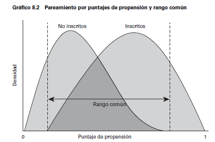

---
format:
  revealjs:
    theme: ["./theme-ic.scss"]
    width: 1600
    height: 900
    slide-number: c/t
    center: false
    scrollable: false
    title-slide: false
    logo: logo-CIDE.jpg
    footer: "Inferencia Causal · Emparejamiento"
    include-in-header:
      - _ic-header.html
      - fontawesome.html
---


```{r setup, include=FALSE}
knitr::opts_chunk$set(echo = FALSE, fig.path = "figures/")

library(tidyverse)
library(janitor)
library(sandwich)
#library(nnet)
#library(mlogit)
library(readr)
library(clubSandwich)
library(modelsummary)
library(estimatr)
library(haven)
library(MatchIt)
library(cobalt)
library(lmtest)


xfun::pkg_load2(c('base64enc', 'htmltools', 'mime'))
```


# Emparejamiento {.portada background-color="#163D34" data-state="nochrome"}

::: {.pa-eyebrow}
Inferencia Causal
:::

[Irvin Rojas]{.pa-name} <span class="pa-icons"><a href="https://github.com/rojasirvin" target="_blank" aria-label="GitHub"><i class="bi bi-github"></i></a> <a href="https://scholar.google.com/citations?hl=es&user=FUwdSTMAAAAJ&view_op=list_works&sortby=pubdate" target="_blank" aria-label="Google Scholar"><i class="bi bi-mortarboard-fill"></i></a> <a href="mailto:irvin.rojas@cide.edu" aria-label="Correo"><i class="bi bi-envelope-fill"></i></a></span>

::: {.pa-inst}
Centro de Investigación y Docencia Económicas<br>Maestría en Economía
:::
```{css, echo = FALSE}
.huge .remark-code { /*Change made here*/
  font-size: 200% !important;
}
.tiny .remark-code { /*Change made here*/
  font-size: 60% !important;
}
```

# Emparejamiento {.divider background-color="#9B2247" data-state="nochrome"}


# Estas primeras secciones estaban en regresión


## Supuesto de independencia condicional

- El **supuesto de independencia condicional** significa que, condicional en una serie de características $X_i$, el sesgo de selección desaparece:

$$\{y_{0i},y_{1i}\}\perp D_i | X_i$$

::: {.fragment}

- Supongamos que $D_i$ es ir o  no a la universidad y la variable de interés es el ingreso
- Sabemos que la comparación observacional nos da:

$$
\begin{aligned}
E(y_i|D_i=1)-E(y_i|D_i=0)=&\overbrace{ E(y_{1i}-y_{0i}|D_i=1)}^{\text{Efecto promedio en los tratados}}+\\& \underbrace{E(y_{0i}|D_i=1)-E(y_{oi}|D_i=0)}_{\text{Sesgo de selección}}
\end{aligned}
$$

- Es posible que aquellos que no fueron a la universidad de todos modos hubieran tenido un mayor salario, por lo que el sesgo de selección es positivo

:::


## Supuesto de independencia condicional

- El SIC implica que si hacemos la comparación condicional en $X_i$, el sesgo desaparece
$$
\begin{aligned}
E(y_i|X_i,D_i=1)-E(y_i|X_i,D_i=0)=E(y_{1i}-y_{0i}|X_i)
\end{aligned}
$$
- Es decir, que si comparamos a personas con y sin tratamiento, con los $X_i$ *fijos*, el sesgo de selección desaparece

- *Mantener fijas* las $X$ es el análogo a obtener el promedio del salario en cada nivel de escolaridad en la gráfica de la FEC descrita anteriormente


## Supuesto de independencia condicional

- Para generalizar el concepto cuando la variable tiene más de dos valores (como con la educación $s_i$), escribamos $Y_{si}\equiv f_i(s)$

- Esta función nos dice cuál sería el ingreso de $i$ bajo todos los posibles niveles de $s$

- En este caso, asumimos el SIC, que se traduce en: $$Y_{si}\perp s_i | X_i$$

- En diseños experimentales, el SIC surge porque el tratamiento se asigna de forma aleatoria

- Pero con datos *observacionales*, el SIC significa que $s_i$ es *casi como si fuera asignado de manera aleatoria* cuando condicionamos en $X_i$

## Supuesto de independencia condicional

- En los datos solo observamos $Y_i=f_i(s_i)$
- Dado el SIC, podemos hacer comparaciones de ingreso promedio para distintos niveles de educación:
$$E(Y_i|X_i,s_i=s)-E(Y_i|X_i,s_i=s-1)=E(f_i(s)-f_i(s-1)|X_i)$$

::: {.fragment}

- Notemos que lo impráctico de esto es que tendríamos que hacer comparaciones en pares y luego tratar de hacer un promedio ponderado por el número de individuos en cada nivel de educación

:::


## Regresión para hacer las comparasiones

- Supongamos una función causal para el ingreso
$$f_i(s)=\alpha+\rho s+\nu_i$$

que indica lo que un individuo ganaría para todo valor de $s$ (y no solo el valor realizado $s_i$)

- La única parte aleatoria es el error con media cero $\nu_i$, que captura los factores no observados que afectan los ingresos

- Sustituyendo el valor observado:

$$Y_i=\alpha+\rho s_i+\nu_i$$

- $s_i$ puede estar correlacionado con los resultados potenciales $f_i(s)$, es decir, correlacionado con el error $\nu_i$


## Regresión para hacer las comparasiones

- Supongamos que el SIC se cumple dado un vector $X_i$

- Descompongamos el error en una función lineal de las características $X_i$ y un error $u_i$:
$$\nu_i=X_i'\gamma+u_i$$

donde se asume que $E(\nu_i|X_i)=X_i'\gamma$ y donde $u_i$ y $X_i$ no están correlacionados

- Si se cumple el SIC, entonces:

$$
\begin{aligned}
E(f_i(s)|X_i,s_i)=E(f_i(s)|X_i)&=\alpha+\rho s+E(\nu_i|X_i) \\
&=\alpha+\rho s + X_i'\gamma
\end{aligned}
$$

- Es decir, en el modelo de regresión causal
$Y_i=\alpha+\rho s_i+ X_i'\gamma+u_i$, $u_i$ no está correlacionado con los regresores $X_i$ y $s_i$

- $\rho$ es el efecto causal de interés

- El supuesto clave es que la única razón por la cual $\nu_i$ y $s_i$ están correlacionados es $X_i$


# Fin de lo traído desde regresión


## Sesgo de selección
 
Las razones que determinan la asignación del tratamiento pueden también determinar el valor de $Y$. Entonces, una comparación observacional nos da el efecto del tratamiento más el sesgo de selección:
    
$$
\begin{aligned}
E(y_i|D_i=1)-E(y_i|D_i=0)=&\overbrace{ E(y_{1i}|D_i=1)-E(y_{0i}|D_i=1)}^{\text{Efecto promedio en los tratados}}+\\& \underbrace{E(y_{0i}|D_i=1)-E(y_{oi}|D_i=0)}_{\text{Sesgo de selección}}
\end{aligned}
$$

Una forma de eliminar el sesgo de selección es mediante la asignación aleatoria del tratamiento; sin embargo, esto no siempre es posible por lo que recurrimos a supuestos para eliminar el sesgo de selección.
 

## Supuesto de independencia

El *supuesto de independencia* condicional dice que al *controlar* por una serie de características $X_i$, el tratamiento es *como* si fuera aleatorio:


$$
E(Y(1)|D=1,X)=E(Y(1)|D=0,X)
$$

$$
E(Y(0)|D=1,X)=E(Y(0)|D=0,X)
$$

Esto es, los valores esperados de $Y(1)$ y $Y(0)$ son iguales cuando nos fijamos en cada valor de $X$.

# Matching exacto {.divider background-color="#9B2247" data-state="nochrome"}

## Matching exacto
 
Un estimador de matching exacto consiste en *emparejar* individuos tratados y no tratados para cada valor específico de las $X$ y luego tomar el promedio ponderado de las diferencias.
  
Tenemos datos observacionales de individuos que recibieron y no recibieron un tratamiento y tenemos una serie de características discretizadas en $X_i$.

Asumimos que controlando por las características $X_i$ podemos obtener diferencias causales y luego hacemos un promedio de dichas diferencias.


## Ejemplo: programa hipotético de empleo

Usemos [el ejemplo](https://mixtape.scunning.com/matching-and-subclassification.html?panelset=r-code) de MT (The Mixtape):

```{r}

read_data <- function(df)
{
  full_path <- paste("https://raw.github.com/scunning1975/mixtape/master/", 
                     df, sep = "")
  df <- read_dta(full_path)
  return(df)
}

training_example <- read_data("training_example.dta") %>% 
  slice(1:20)

data.treat <- training_example %>% 
  select(unit_treat, age_treat, earnings_treat) %>% 
  slice(1:10) %>% 
  mutate(earnings_treat=as.numeric(earnings_treat))

data.control <- training_example %>% 
  select(unit_control, age_control, earnings_control)

data.matched <- training_example %>% 
  select(unit_matched, age_matched, earnings_matched) %>% 
  slice(1:10)

```

## Ejemplo: programa hipotético de empleo


:::: {.columns}

::: {.column width="50%"}

Los individuos tratados:

```{r}
data.treat

```
:::

::: {.column width="50%"}

Mientras que los no tratados:
  
```{r}
data.control
```
:::

::::


## Comparación observacional

Si hiciéramos diferencias simples obtendríamos:

```{r echo=T, message=F, warning=F }
mean(data.treat$earnings_treat)
mean(data.control$earnings_control)

#Diferencia
mean(data.treat$earnings_treat)- mean(data.control$earnings_control)
```

Parece que en el grupo de control ganan más (efecto de tratamiento negativo).

El principal problema con esta diferencia es que sabemos que los ingresos crecen con la edad. Pero notemos que la muestra de no tratados tiene mayor edad promedio:

```{r echo=T, message=F, warning=F }
mean(data.treat$age_treat)
mean(data.control$age_control)

#Diferencia
mean(data.treat$age_treat)- mean(data.control$age_control)
```

Es decir, estaríamos *confundiendo* el efecto de la edad.


## Muestra emparejada


Construyamos la muestra apareada: para cada individuo en el grupo tratado, buscaremos uno en el de control que tenga la misma edad. Cuando le encontramos un individuo no tratado al tratado con la misma edad decimos que esa pareja hizo *match*.

Por ejemplo, la primera unidad tratada, con 18 años y un ingreso de 9500 estaría emparejada con la unidad 14 del grupo de control, que tiene también 18 años y un ingreso de 8050.

Para dicho individuo de 18 años, su ingreso contrafactual sería 8050.

Cuando hay varias unidades en el grupo de control que pueden ser empatadas con la de tratamiento, podemos construir el ingreso contrafactual calculando el promedio.

Del grupo de control, los individuos 10 y 18 tienen 30 años, con ingresos 10750 y 9000, por lo que usamos el promedio (9875) para crear el contrafactual del individuo tratado de 30 años de la fila 10.

## Muestra emparejada

La muestra emparejada o contrafactual será:

```{r}
#| output-location: column

data.matched

```

## Muestra emparejada

Noten que la edad es la misma entre los tratados y la muestra apareada:


:::: {.columns}

::: {.column width="50%"}

Muestra de tratados:

```{r echo=T}
mean(data.treat$age_treat)
```

:::

::: {.column width="50%"}

Muestra emparejada:

```{r echo=T}
mean(data.matched$age_matched)
```
:::

::::


En este caso, decimos que la edad *está balanceada*.

Y entonces podemos calcular el efecto de tratamiento como la diferencia de ingresos entre los tratados y los no tratados en la muestra emparejada:

```{r}
#Diferencia
mean(data.treat$earnings_treat)- mean(data.matched$earnings_matched)
```

En este caso, encontramos un efecto positivo del programa de 1695 unidades monetarias.

## Estimador de matching exacto

Lo anterior nos permite definir el **estimador de matching exacto del TOT** como:

$$\hat{\delta}_{TOT}=\frac{1}{N_T}\sum_{D_i=1}\left(Y_i-\left(\frac{1}{M}\sum_{m=1}^{M}Y_{jm(i)}\right)\right)$$

## Importancia del soporte común

Observemos lo que ocurre con la distribución de edades en ambos grupos:


:::: {.columns}

::: {.column width="50%"}

Para los tratados:

```{r grafica_tratados}
#| fig-height: 5
ggplot(training_example, aes(x=age_treat)) +
  stat_bin(bins = 10, na.rm = TRUE)
```

:::

::: {.column width="50%"}

Mientras que para los no tratados:

```{r grafica_notratados}
#| fig-height: 5
ggplot(training_example, aes(x=age_control)) +
  geom_histogram(bins = 10, na.rm = TRUE)
```
:::

::::

El supuesto de traslape débil para identificar el TOT significa que para cada unidad tratada, hay al menos un no tratado. De otra forma, no podemos hacer la comparación.


## Estimador de matching exacto


- Hasta aquí, solo hemos imputado el contrafactual para cada unidad en el grupo tratado

- Si podemos imputar también, para cada unidad no tratada, su correspondiente contrafactual tratado, podemos estimar el ATE

- Y un **estimador de matching exacto del ATE** sería:


$$\hat{\delta}_{ATE}=\frac{1}{N}\sum_{i}^N(2D_i-1)\left(Y_i-\left(\frac{1}{M}\sum_{m=1}^{M}Y_{jm(i)}\right)\right)$$


## Ejemplo de la vida real

- Tenemos varias características en $X_i$, no solo la edad

- Esto hace que cada valor $X_i=x_i$ este representado por una *celda*
    
- $X_i$ incluye, por ejemplo, raza, año de solicitud de ingreso al programa, escolaridad, calificación en examen de aptitud, año de nacimiento (son las características del ejemplo que vermeos más adelante)
  
- Estas características definen *celdas* y dentro de cada celda tenemos tratados y no tratados
 

## Efecto del tratamiento con matching exacto
 
- El TOT asumiendo inconfundibilidad:

$$
\begin{aligned}
\delta^M=TOT&=E\left\{ E(y_{1i}|X_i,D_i=1)-E(y_{0i}|X_i,D_i=0)|D_i=1\right\} \\
&=E\left\{\delta_X | D_i=1\right\}
\end{aligned}
$$


- $\delta_X$ es la diferencia de ingresos promedio entre estados de tratamiento para cada valor de $X_i$
    
- Con $X_i$ discreta y con una muestra disponible:

$$
\delta^M=\sum_{x} \delta_x P(X_i=x|D_i=1)
$$

## Ejemplo: veteranos de guerra en Estados Unidos

- [Angrist (1998)](https://www.jstor.org/stable/2998558), Estimating the Labor Market Impact of Voluntary Military Service Using Social Security Data on Military Applicants

- El tratamiento es haber servido en el ejercito, algo que claramente tiene autoselección

- Se trata de estimar el efecto en el ingreso

- Los autores construyen celdas de acuerdo a las características antes mencionadas

  - Raza, año de solicitud de ingreso al programa, escolaridad, calificación en examen de aptitud, año de nacimiento


## Ejemplo: veteranos de guerra en Estados Unidos


- Efectos estimados usando distintas metodologías

- Los impactos estimados usando el matching exacto se encuentran bajo la columna *Controlled contrast*


:::: {.columns}

::: {.column width="50%"}

```{r}
#| echo: false
knitr::include_graphics("ExactMatching_effects_table_a.jpg", dpi = 50)

```

:::

::: {.column width="50%"}

```{r}
#| echo: false
knitr::include_graphics("ExactMatching_effects_table_b.jpg", dpi = 50)
```
:::

::::


## Ejemplo: veteranos de guerra en Estados Unidos

- Noten que la columna (2) muestra lo que se hubiera concluido si solo se comparan diferencias de medias
    
- Antes de 1980, las diferencias eran muy pequeñas (cero en términos prácticos)
  
- En esta aplicación esta comparación llevaría a conclusiones incorrectas
  
- Además, las diferencias para no-blancos y blancos son distintas
  
- Hay un pico en los efectos alrededor de 1982
  
- En esta aplicación, los resultados por *matching* y regresión son muy parecidos hasta 1984
  
- La conclusión es que existe evidencia de efectos negativos en los ingresos por haber servido en el ejército en los blancos y efectos positivos para los individuos de otras razas


## Ejemplo: veteranos de guerra en Estados Unidos


:::: {.columns}

::: {.column width="50%"}

Para personas identificadas como blancas:

```{r}
#| echo: false
knitr::include_graphics("ExactMatching_effects_graph_a.jpg", dpi = 50)

```

:::

::: {.column width="50%"}

Para personas identificadas como no blancas:

```{r}
#| echo: false
knitr::include_graphics("ExactMatching_effects_graph_b.jpg", dpi = 50)
```
:::

::::


# Propensity Score Matching {.divider background-color="#9B2247" data-state="nochrome"}


## Métodos de apareamiento o *matching*

- Los métodos apareamiento o *matching* recaen en el **supuesto de independencia condicional**

- Al *controlar* por una serie de características $X_i$, el tratamiento es *como* si fuera aleatorio

- Podemos escribir

$$
E(Y(1)|D=1,X)=E(Y(1)|D=0,X)
$$

$$
E(Y(0)|D=1,X)=E(Y(0)|D=0,X)
$$

- Esto es, los valores esperados de $Y(1)$ y $Y(0)$ son iguales cuando nos fijamos en cada valor de $X$


## Supuestos de identificación del TOT
 
**Supuesto 1. Inconfundibilidad**
  
$$
Y(0), Y(1) \perp  D|X
$$

- Dado un conjunto de variables $X$, los resultados potenciales son independientes del tratamiento
  
- $X$ debe incluir todas las variables que determinan el tratamiento y los resultados potenciales
  
**Supuesto 2: Traslape**
  
$$
0< P(D=1|X) < 1
$$

- $X$ no predice $D$ perfectamente
  
- Personas con el mismo $X$ tienen probabilidad positiva de ser tratados y no tratados


## Supuestos de identificación del TOT
 
- Cuando se cumple **Supuesto 1** $+$ **Supuesto 2**  se conoce como **ignorabilidad fuerte**
  
- Heckman (1998) muestra que estás condiciones son demasiado estrictas
  
- Para identificar el $TOT$ es suficiente:
    
- **Supuesto 1a. Inconfundibilidad en el control**

$$
Y(0) \perp  D | X
$$

- **Supuesto 2a. Traslape débil**

$$
P(D=1|X) < 1
$$


## Matching exacto es impráctico
 
  - En la práctica es difícil manejar problemas en espacios de múltiples dimensiones: **maldición de la dimensionalidad**
 
- El problema de la maldición de la dimensionalidad se exacerba con el tamaño limitado de las bases de datos
 
- Si $X$ tuviera solo indicadores binarios, el número de posibles combinaciones sería $2^s$
   
- Por ejemplo, si solo tuviéramos $X_1=\{\text{menor de 35 años}, \text{con 35 años o más}\}$, $X_2=\{\text{más que preparatoria}, \text{menos que preparatoria}\}$, $X_3=\{\text{indígena}, \text{no indígena}\}$, tendríamos que hacer ocho comparaciones:
   
  - menor de 35 años, más que preparatoria, indígena
  - menor de 35 años, más que preparatoria, no indígena
  - ...
  - con 35 años o más, menos que preparatoria, no indígena

- Pero Si $X$ incluye muchas variables, algunas tomando muchos valores, esto se vuelve imposible de realizar
  

## Maldición de la dimensionalidad

- El requerimiento de soporte común significa que debemos tener tratados y no tratados para cada valor de $X_i$ para hacer comparaciónes

- Cuando $X_i$ tiene muchas dimensiones, resulta un problema de *escasez* o *sparseness*

- Algunas celdas estarán vacías, o solo tendrán tratados, o solo tendrán no tratados


- Si tenemos unidades en todas las celdas de control, **aún podemos estimar el TOT**

  - Noten que cuando completamos la fase pareada en el ejemplo hipotético, siempre encontramos a alguien en el grupo de control para asignárselo a un tratado
  
  - Pero al revés, no siempre es posible: por ejemplo, no hay ningún tratado de 48 años


## Teorema del PS (Rosenbaum y Rubin, 1983)
 
- **Corolario 1. Inconfundibilidad dado el propensity score**
 
- El **Supuesto 1** implica:
 
$$
Y(0), Y(1) \perp  D|P(X)
$$
 
donde $P(X)=P(D=1|X)$ es la probabilidad de ser tratado dado un conjunto de covariables $X$, el *propensity score* o PS
  

## Efecto del tratamiento
 
- El efecto del tratamiento, bajo el supuesto de inconfundibilidad dado el propensity score, es:
   
$$
TOT^{PSM}=E_{P(X)|D=1} \left(E(Y(1)|D=1, P(X))-E(Y(0)|D=0,P(X)) \right)
$$
 
 
- El $TOT$ es la diferencia en la variable de resultados de los tratados y los no tratados pesada por la distribución del PS en los tratados
  


## Estimación
 
- Debemos por tanto primero calcular el PS
 
- Se empatan o se hace match de unidades que fueron tratadas con unidades que no lo fueron usando el PS
 
- Se mide la diferencia en la variable de resultados entre estos grupos
 
- Se hace un promedio ponderado de las diferencias
  

## Implementación

1. Estimación del PS
 
2. Escoger el algoritmo de matching
 
3. Comprobar la calidad del matching
 
4. Estimar el $TOT$


## Especificar el modelo del PS
 
- Se usa un modelo *probit* o *logit*
 
  - **Prueba y error**.   Maximizar la tasa clasificación de tratamientos y controles usando $\bar{P}$, la proporción de tratamientos en la muestra
 
  - **Significancia estadística**.   Usar solo las variables estadísticamente significativas, comenzando con un modelo muy básico
 
  - **Validación cruzada**.   Comenzar con un modelo simple y agregar grupos de variables comparando las que reduzcan el error cuadrático promedio

- El propósito del PS es sobre todo generar balance de las variables en $X$


# Algoritmos de matching {.divider background-color="#9B2247" data-state="nochrome"}


## Vecino más cercano
 
- A cada individuo del grupo tratado se le asigna uno del grupo de comparación en términos del PS
 
- Puede hacerse con remplazo o sin remplazo
 
- Puede emplearse también sobremuestreo (*oversampling*), es decir, asignar más de un individuo del grupo de comparación

- Por ejemplo, NN 5 significa que a cada individuo tratado se le asignan los cinco individuos del grupo no tratado con los PS estimados más cercanos
  
  
## Vecino más cercano


:::: {.columns}

::: {.column width="50%"}

| Tratados | $\hat{p}$ |
|:---: |:---:|
| a | 0.031 |
| b | 0.042 |
| c | 0.07 |
| $\vdots$ | $\vdots$ |

:::

::: {.column width="50%"}


| No tratados | $\hat{p}$ |
|:---: |:---:|
| A | 0.034 |
| B | 0.068 |
| C | 0.21 |
| $\vdots$ | $\vdots$ |

:::

::::


- Con vecino más cercano, el individuo $a$ tratado estaría emparejado con el $A$ no tratado

- Si el emparejamiento es con reemplazo, $A$ podría ser usado otra vez
y $b$ también sería emparejado con $A$

- Pero si el emparejamiento es sin reemplazo, $A$ ya no puede ser usado y a $b$ se le emparejaría con $B$

- Cuando hacemos el pareamiento sin reemplazo, debemos tener una muestra lo suficientemente grande

- El pareamiento sin reemplazo depende del orden en que se realice el procedimiento


## Caliper y radio
 
- El método de vecino más cercano puede generar malos emparejamientos si el vecino más cercano está muy lejos en términos del PS
  
- Especificar un *caliper* consiste en definir una vecindad aceptable de matching (el caliper) y elegir solo el vecino más cercano dentro del caliper
 
- Con las funciones de R que usaremos más adelante, el *radio* consiste en definir cuántos individuos deberán ser apareados dado que están dentro del caliper
  

## Caliper


:::: {.columns}

::: {.column width="50%"}

| Tratados | $\hat{p}$ |
|:---: |:---:|
| a | 0.031 |
| b | 0.042 |
| c | 0.07 |
| d | 0.11 |
| $\vdots$ | $\vdots$ |

:::

::: {.column width="50%"}

| No tratados | $\hat{p}$ |
|:---: |:---:|
| A | 0.034 |
| B | 0.068 |
| C | 0.21 |
| D | 0.40 |
| $\vdots$ | $\vdots$ |
:::

::::


- El primer paso es fijar el caliper, por ejemplo, de 0.1

- El caliper implica buscar al vecino más cercano dentro de una vecindad de 0.1

- En este ejemplo $c$ podría ser solo emparejado con $B$ si $B$ aún está disponible (porque no ha sido emparejado con nadie o porque, aunque haya sido emparejado, el procedimiento se hace con reemplazo)


## Caliper con sobremuestreo


:::: {.columns}

::: {.column width="50%"}

| Tratados | $\hat{p}$ |
|:---: |:---:|
| d | 0.31 |
| e | 0.39 |
| f | 0.44 |
| g | 0.52 |
| h | 0.55 |
| i | 0.62 |
| $\vdots$ | $\vdots$ |

:::

::: {.column width="50%"}

| No tratados | $\hat{p}$ |
|:---: |:---:|
| R | 0.27 |
| S | 0.29 |
| T | 0.33 |
| U | 0.49 |
| V | 0.57 |
| W | 0.61 |
| $\vdots$ | $\vdots$ |


:::

::::


- Si el caliper se realiza con sobremuestreo, con un caliper de 0.10 y 2 vecinos a $g$ se le asignarían $U$ y $V$ (si estuvieran disponibles)

- Es decir, dentro del caliper, los dos individuos con el PS más cercano


## Radio

:::: {.columns}

::: {.column width="50%"}

| Tratados | $\hat{p}$ |
|:---: |:---:|
| d | 0.31 |
| e | 0.39 |
| f | 0.44 |
| g | 0.52 |
| h | 0.55 |
| i | 0.62 |
| $\vdots$ | $\vdots$ |


:::

::: {.column width="50%"}

| No tratados | $\hat{p}$ |
|:---: |:---:|
| R | 0.27 |
| S | 0.29 |
| T | 0.33 |
| U | 0.49 |
| V | 0.57 |
| W | 0.61 |
| $\vdots$ | $\vdots$ |


:::

::::


- Pero si ahora implementamos radio con un caliper de 0.10, a $g$ se le asignarían $U$, $V$ y $W$ (si estuvieran disponibles)

- Es decir, todos los individuos dentro del caliper


## Estratificación
 
- Partir la región de soporte común en bloques de acuerdo al PS
 
- Estimar el efecto de tratamiento dentro de cada bloque
 
- No hay una regla sobre cuántos estratos usar. Se aconsajan generalmente cinco
 
- Dentro de cada estrato debe haber balance de los covariables

  


## Kernel y métodos no paramétricos
 
- Los métodos anteriores escogen solo unas cuantas unidades del grupo de comparación 
 
- Podemos escoger usar muchas o incluso todas las observaciones del grupo de comparación y pesarlas apropiadamente
 
- Se reduce la varianza pues usamos más información, pero se sacrifica precisión pues se usan observaciones potencialmente muy distantes
 
- Se le otorga más peso a las observaciones más cercanas y menos a las más distantes
  

## Kernel

:::: {.columns}

::: {.column width="50%"}

| Tratados | $\hat{p}$ |
|:---: |:---:|
| d | 0.31 |
| e | 0.39 |
| f | 0.44 |
| g | 0.52 |
| h | 0.55 |
| i | 0.62 |


:::

::: {.column width="50%"}

| No tratados | $\hat{p}$ |
|:---: |:---:|
| R | 0.27 |
| S | 0.29 |
| T | 0.33 |
| U | 0.49 |
| V | 0.57 |
| W | 0.61 |


:::

::::


- Supongamos que estos son todos nuestros datos

- Con un emparejamiento por kernel, a $d$ lo compararemos con todos los individuos, desde $R$ hasta $W$

- La función kernel le dará más peso a $R$, un poco menos a $S$ y así hasta darle muy poco o casi nada de peso a $W$


## ¿Qué método usar?
 
- No hay un método claramente superior a todos los demás
 
- Más aún, el desempeño de cada método depende de cada aplicación
 
- La ruta más seguida es usar varios algoritmos y mostrar la robustez de los resultados a esta elección
  


## Comprobar empíricamente los supuestos
 
- El parámetro $TOT$ solo se calcula sobre la región de sporte común por lo que se debe verificar el traslape del PS calculado para los tratados y no tratados
 
- Otro de los teoremas de Rosenbaum y Rubin (1983) implica que

$$
X \perp  D|P(X)
$$
 
- Esto es, que al controlar por el PS, las variables $X$ no deben proveer información sobre $D$
   
- Se recomienda también hacer una prueba de estratificación

  1. Dividir el rango del soporte común en bloques 
 
  1. Hacer una prueba de medias del PS entre grupos dentro de cada bloque
 
  1. Hacer una prueba de medias de cada variable en $X_i$  entre grupos dentro de cada bloque


## Ilustración del soporte común

```{r}
#| echo: false

```


# Ejemplo en R {.divider background-color="#9B2247" data-state="nochrome"}

## Paquetes

Usaremos dos paquetes nuevos: *MatchIt* y *cobalt*, que pueden descargar como cualquier otro paquete desde CRAN.

## Datos no experimentales de una muestra de mujeres
 
Los datos en [cattaneo_smoking.csv](cattaneo_smoking.csv) (Cattaneo, 2010) son de una muestra de mujeres que incluye un indicador de si la madre fumó durante el embarazo. El propósito es evaluar el efecto de fumar sobre el peso de los bebés al nacer. Se incluyen una serie de covariables que usaremos para modelar el *propensity score*.


## *matchit* para realizar los emparejamientos

La función que usaremos para hacer los emparejamientos es *matchit* de la librería *MatchIt*. Antes de hacer los emparejamientos, construimos la dummy de tratamiento, **smoke**, una dummy para mujeres casadas, **married**, y una dummy para si el caso en cuestión es el primer bebé, **firstbaby**:

```{r}
data.smoking<-read_csv(
  "./cattaneo_smoking.csv",
  locale = locale(encoding = "latin1")) %>% 
  clean_names() %>% 
  mutate(smoke=ifelse(mbsmoke=="smoker",1,0)) %>% 
  mutate(married=ifelse(mmarried=="married",1,0)) %>% 
  mutate(firstbaby=ifelse(fbaby=="Yes",1,0))

#Asegurarse que no hay NA, matchit no acepta NA
data.smoking <- data.smoking[complete.cases(data.smoking), ]

#Una semilla para todo el trabajo
set.seed(1021)
```


## Comparación observacional

Notemos que, si solo comparamos a las mujeres que fuman con las que no fuman, estamos comparando personas muy diferentes:


```{r}
#| output-location: column

datasummary_balance(~smoke,
                    fmt = "%.2f",
                    data = select(data.smoking, smoke, 
                                  married, firstbaby, 
                                  medu, nprenatal, 
                                  foreign, mhisp, fage),
                    dinm_statistic = "p.value",
                    title = "Pruebas de balance",
                    notes = "Fuente: Cattaneo (2009)")
```


## Estimación del PS

Una manera de hacer más eficiente el uso de las *fórmulas* es usando *as.formula*:

```{r}
binaria <- "smoke"
variables <- c("married", "firstbaby", "medu", "nprenatal", "foreign", "mhisp", "fage")

ps <- as.formula(paste(binaria,
                         paste(variables,
                               collapse ="+"),
                         sep= " ~ "))
print(ps)
```

Usamos *matchit* para estimar el PS y realizar los emparejamientos con el algoritmo que indiquemos:

```{r}
m.out <- matchit(formula=ps,
                 method = "nearest",
                 ratio = 1,
                 distance= "logit",
                 replace = FALSE,
                 data = data.smoking)
```

## Estimación del PS

El resumen del procedimiento da bastante información sobre el pareamiento:

```{r}
summary(m.out)
```


## Verificación del balance


:::: {.columns}

::: {.column width="50%"}

Gráfico de nube:

```{r}
plot(m.out, type = "jitter")
```


:::

::: {.column width="50%"}

Histograma:

```{r}
plot(m.out, type = "hist")
```


:::

::::


## Muestra emparejada

Podemos guardar un objeto con la muestra emparejada usando *match.data* y observar quién hace match con quién:

```{r}
#| output-location: column

m.data <- match.data(m.out)

head(m.out$match.matrix)
```


## Muestra emparejada

Una propuesta para determinar si el emparejamiento fue exitoso es observar las diferencias promedio estandarizadas (SMD) entre los grupos tratados y no tratados, antes y después del emparejamiento. 

$$SMD_X=\frac{\bar{X}_T-\bar{X}_{NT}}{\sqrt{S^2_T+S^2_{NT}}}$$
    
También vale la pena no perder de vista la razón de varianzas (VR). Se espera que este ratio no sea muy distinto de 1 después de hacer el emparejamiento:
    
$$VR=\frac{S^2_T}{S^2_{NT}}$$

Como regla de dedo, una diferencia de 0.1 o menos en el SMD se considera un buen balance. Por ejemplo, la escolaridad de la madre tenía un SDM de -0.5955 en la muestra en bruto, pero con el emparejamiento el SDM se vuelve de solo 0.0171.

## *Loveplot*

Usando la librería *cobalt* podemos construir un *love plot* que representa gráficamente las diferencias antes y después del emparejamiento

```{r}
#| output-location: column
#| 
love.plot(bal.tab(m.out),
          threshold = .1)
```


## Efecto de tratamiento

Existen muchas maneras de explotar la muestra emparejada. Aquí veremos la más sencilla. Simplemente consideremos a la muestra emparejada como si viniera de un experimento. Sin embargo, debemos poner especial atención a la forma de hacer inferencia pues no debemos ignorar que el PS es estimado.

Dependiendo de si el emparejamiento ocurre con o sin reemplazo, y de la naturaleza de la variable dependiente, se recomiendan distintas maneras de estimar el efecto del tratamiento y hacer inferencia. Una buena guía está en la documentación de [MatchIt](https://kosukeimai.github.io/MatchIt/articles/estimating-effects.html).

Por ejemplo, cuando se realiza el emparejamiento sin reemplazo, [Abadie & Spiess (2019)](https://www.tandfonline.com/doi/full/10.1080/01621459.2020.1840383?casa_token=7VdQFPydVtIAAAAA%3A3VRshT4TmqjnyzS2Nz2EBmFi54NlHDIWdtD-mDdAdPHuv51BhbXh1qYOwsRo8yH_WhA1UoUbvP0Kqg) muestran que podemos estimar los errores estándar simplemente agrupando a nivel de pareja (o grupo) emparejado (**subclass** es una columna que enumera a las parejas o grupos emparejados y es construida automáticamente por *matchit*).


## Efecto de tratamiento

Usando una regresión con la muestra emparejada

```{r}
tt1 <- lm(bweight ~ smoke,
          data = m.data,
          weights = weights)

#Errores agrupados a nivel subclass
coeftest(tt1,
         vcov. = vcovCL,
         cluster = ~subclass)

```


## Efecto de tratamiento

Algunos autores incluyen los covariables en su estimación:

```{r}
tt2 <- lm(bweight ~ smoke + married + firstbaby + medu + nprenatal + foreign + mhisp + fage,
          data = m.data,
          weights = weights)

#Errores agrupados a nivel subclass
coeftest(tt2,
         vcov. = vcovCL,
         cluster = ~subclass)

```

Cuando el emparejamiento es con reemplazo, las unidades no tratadas son emparejadas varias veces (aparecen repetidas en la muestra emparejada), lo cual debe ser considerado para estimar los efectos del tratamiento y hacer inferencia. Por ejemplo, se puede usar *bootstrap* para obtener el error estándar del efecto del tratamiento cuando la variable de impacto es continua.


## Recomendaciones prácticas
 
- Las características $X$ que determinan la probabilidad de tratamiento deben ser observables
 
- Las variables usadas para calcular el PS no deben haber sido afectadas por el tratamiento
 
- Idealmente usamos variables $X$ pre-intervención
 
- Cuando no hay $X$ pre-intervención, a veces se puede obtener el PS con variables post-intervención siempre y cuando estas no hayan sido afectadas por el tratamiento (pocas veces recomendado)

- Se recomienda ampliamente ver:

  - Caliendo, M., & Kopeinig, S. (2008). Some practical guidance for the implementation of propensity score matching. *Journal of Economic Surveys*, 22(1), 31-72.
  
  
  
## Conclusión

- Las técnicas de PSM dependen de varios supuestos teoricos fuertes

- La implementación implica que las variables en $X$ son aquellas que permiten hacer los supuestos de inconfundibilidad dado el PS

- En la estimación del PS se toma la decisión sobre la forma funcional

- Los efectos de tratamiento pueden ser distintos entre diferentes algoritmos de emparejamiento y la especificación del PS

- La crítica más importante es que la mayoría de las veces nos preocupa más la autoselección basada en no observables que en observables

- Pero muchas veces es todo lo que tenemos a la mano

- Hay que hacer análisis de sensibilidad a las distintas decisiones

- Presentar resultados transparentes


# Emparejamiento {.final background-color="#9B2247" data-state="nochrome"}

::: {.f-eyebrow}
Inferencia Causal
:::

::: {.f-inst}
[Irvin Rojas](https://rojasirvin.github.io/)
:::

::: {.f-inst}
CIDE · Maestría en Economía
:::

<span class="f-icons"><a href="https://github.com/rojasirvin" target="_blank" aria-label="GitHub"><i class="bi bi-github"></i></a> <a href="https://scholar.google.com/citations?hl=es&user=FUwdSTMAAAAJ&view_op=list_works&sortby=pubdate" target="_blank" aria-label="Google Scholar"><i class="bi bi-mortarboard-fill"></i></a> <a href="mailto:irvin.rojas@cide.edu" aria-label="Correo"><i class="bi bi-envelope-fill"></i></a></span>

::: {.f-rule}
:::

::: {.f-copy}
© 2026 Irvin Rojas. Distribuido bajo licencia Creative Commons **CC BY-NC-SA 4.0**. Los materiales de terceros citados conservan sus propios derechos.
:::
