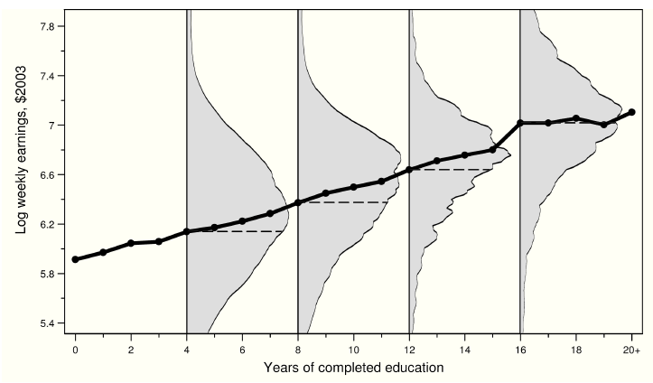
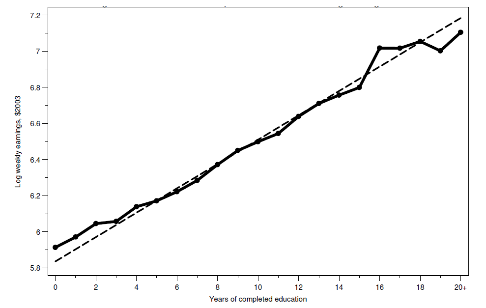
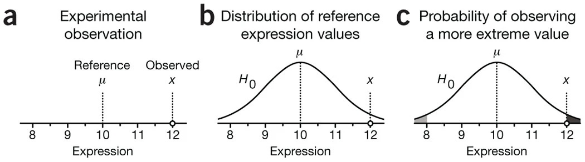

---
format:
  revealjs:
    theme: ["./theme-ic.scss"]
    width: 1600
    height: 900
    slide-number: c/t
    center: false
    scrollable: false
    title-slide: false
    logo: logo-CIDE.jpg
    footer: "Inferencia Causal · Regresión e inferencia estadística"
    include-in-header:
      - _ic-header.html
      - fontawesome.html
---

```{r setup, include=FALSE}
knitr::opts_chunk$set(echo = FALSE, fig.path = "figures/")
library(tidyverse)
library(magick)
library(reticulate)
library(knitr)
library(kableExtra)
xfun::pkg_load2(c('base64enc', 'htmltools', 'mime'))
```


# Regresión e inferencia estadística {.portada background-color="#163D34" data-state="nochrome"}

::: {.pa-eyebrow}
Inferencia Causal
:::

[Irvin Rojas]{.pa-name} <span class="pa-icons"><a href="https://github.com/rojasirvin" target="_blank" aria-label="GitHub"><i class="bi bi-github"></i></a> <a href="https://scholar.google.com/citations?hl=es&user=FUwdSTMAAAAJ&view_op=list_works&sortby=pubdate" target="_blank" aria-label="Google Scholar"><i class="bi bi-mortarboard-fill"></i></a> <a href="mailto:irvin.rojas@cide.edu" aria-label="Correo"><i class="bi bi-envelope-fill"></i></a></span>

::: {.pa-inst}
Centro de Investigación y Docencia Económicas<br>Maestría en Economía
:::
# Motivación del uso de regresión en inferencia causal {.divider background-color="#9B2247" data-state="nochrome"}


## Regresión como función de esperanza condicional

- Olvidemos por ahora la causalidad y centremonos en la conexión entre dos variables, $y$ y $s$ (ingreso y educación)

- La **función de esperanza condicional** es una forma de describir la relación entre estas dos variables

- **Función de esperanza condicional**: la FEC de $y_i$ dado un vector de regresores $X_i$ es la esperanza o promedio poblacional de $y_i$ cuando mantenemos fijo $X_i$ y se denota $E(y_i|X_i)$

- Para representar una realización particular de $X_i$ escribimos $X_i=x_i$, por lo que la FEC es $E(y_i|X_i=x_i)$

- Con $y_i$ discreta, la FEC se expresa como

$$E(y_i|X_i=x_i)=\sum_t t P(y_i=t|X_i=x_i)$$

## Ejemplo de FEC: salarios y educación en Estados Unidos

:::: {.columns}

::: {.column width="50%}
- La figura 3.3.1 en MHE muestra la FEC de salarios en Estados Unidos
- Para cada año de educación, vemos cuál es el (log) del ingreso semanal
- La figura muestra dos cosas principales:
  - La clara relación positiva entre salarios y educación
  - La gran variabilidad en salarios para un nivel de educación dado

:::

::: {.column width="50%}

```{r, out.width="100%",fig.cap='Fuente: Angrist & Pischke (2009)',fig.align='center'}

```

:::

::::


## Teorema de la regresión de la FEC

- MHE provee varias motivaciones de usar regresión al relacionar la función de regresión con la FEC
- Aquí vamos a rescatar el que considero más intuitivo
- **Teorema de la regresión de la FEC**: la función $X_i'\beta$ es la aproximación lineal de mínimos errores cuadrados promedio de $E(y_i|X_i)$:

$$\beta=\arg\min_b E((E(y_i|X_i)-X_i'b) ^2)$$

- Lo que nos dice este teorema es que si yo quiero **aproximar** la FEC y mi criterio para obtener la mejor aproximación es un problema de mínimos cuadrados promedio, entonces lo mejor que puedo hacer es que mi aproximación sea $X'\beta$


## Teorema de la regresión de la FEC

- Este teorema nos dice que si pensamos en en aproximar $E(y_i|X_i)$, incluso aunque la FEC no sea lineal, la función de regresión nos da la mejor aproximación lineal
- Este teorema es lo más cercano a como interpretamos la regresión en evaluación pues más que querer predicciones de $y$ para un individuo $i$, nos interesa la relación promedio entre las variables
- Vale la pena notar que aquí hablamos de la función de regresión **poblacional**, es decir, aún tenemos que hablar sobre cómo estimarla


## Teorema de la regresión de la FEC

- **Demostración**: para la demostración, consideren el problema de regresión poblacional: $$\beta=\arg\min_b E((y_i-X_i'b)^2)$$

- Podemos sumar y restar $E(y_i|X_i)$ y reescribir $(y_i-X_i'b)^2$ como: 

$$(y_i-X_i'b)^2 = ((y_i-E(y_i|X_i))+(E(y_i|X_i)+X_i'b))^2= \\
=(y_i-E(y_i|X_i))^2+(E(y_i|X_i)-X_i'b)^2+2(y_i-E(y_i|X_i))(E(y_i|X_i)-X_i'b)$$


- El término $(y_i-E(y_i|X_i))^2$ no involucra $b$ por lo que no importa en el proceso de optimización

- Por la **Propiedad de Descomposición de la FEC**, $2(y_i-E(y_i|X_i))(E(y_i|X_i-X_i'b))=0$

- Nos queda $(E(y_i|X_i)+X_i'b)^2$, que es exactamente el mismo problema que el del **Teorema de la regresión de la FEC**

## Teorema de la regresión de la FEC

:::: {.columns}

::: {.column width="50%}
- La figura 3.1.2 en MHE ilustra este teorema
- La línea sólida es la FEC de la relación años de educación - salario
- La línea sólida muestra los promedios del salario para cada año de educación
- La línea quebrada muestra la línea de regresión usando microdatos
  - Graficar el coeficiente $\beta$ que resulta al correr $y_i=\alpha+\beta s_i+u_i$
- El teorema de la regresión de la FEC dice que obtenemos la misma recta si hacemos una regresión de $E(y_i|s_i)=\alpha+\beta s +u$

:::

::: {.column width="50%}
```{r, out.width="80%",fig.cap='Fuente: Angrist & Pischke (2009)',fig.align='center'}

```

- Es decir, calculamos las medias del salario para cada nivel de educación y luego se hacemos una regresión de las medias en función de los niveles de educación (dándole más peso a las observaciones que aportaron más datos a la media de cada nivel)

:::

::::


## Modelos saturados

- Son modelos de regresión donde incluimos una variable categórica para cada uno de los posibles valores que tomen las $X_i$

- Del ejemplo con los datos de EUA, hay 21 posibles años de educación, entonces un modelo saturado es:

$$y_i=\alpha+\beta_1 c_{1i} + \beta_2 c_{2i} + \ldots + \beta_{21} c_{21i} + u_i$$
donde $c_{ji}=1$ si el individuo $i$ tiene una educación $s_{i}=j$

::: {.fragment}
- El $j$-ésimo coeficiente $\beta_j$ es el efecto de tener el nivel de educación $j$
- Además, $\alpha=E(y_i|s_i=0)$, se conoce como la categoría omitida
- Podemos escoger la categoría omitida que tenga más sentido

:::


## Modelos saturados

- Si tuviéramos dos características, sexo y urbano-rural, un modelo saturado incluye un *término interacción*:


$$y_i=\alpha+\beta_H x_{Hi} + \beta_R x_{Ri}+ \beta_{HR} x_{Hi}x_{Ri}+u_i$$


- A los coeficientes $\beta_H$ y $\beta_U$ se les conoce como *efectos principales*

- El término de interacción $\beta_{HR}$ nos dice cómo cambia el ingreso entre individuos por tipo de localidad y por sexo 

::: {.fragment}
- Un modelo saturado, si usamos sexo y $\tau$ categorías de educación, sería:
$$y_i=\alpha+\beta_H x_{Hi}+\sum_{j=1}^{\tau} \beta_j c_{ji} + \sum_{j=1}^{\tau}\beta_{Hj}(x_{Hi}c_{ji})  + u_i$$
:::


## Regresión y causalidad

- Lo que hemos visto hasta ahora nos dice que la regresión es nuestro mejor aproximación lineal a la FEC

- Pero la regresión será causal solo si la FEC es causal

- Con lo que hemos visto del modelo de resultados potenciales, podemos tener una interpretación causal de la FEC

::: {.fragment}
- La **FEC es causal** cuando describe las diferencias en resultados potenciales promedio para una población de referencia fija (Angrist and Pischke, 2009)
- En la relación entre educación y salarios, una FEC causal describiría lo que un individuo ganaría con distintos niveles de educación

:::


::: {.fragment}

- Hay otro caso en el que la regresión puede tener interpretación causal, cuando existe **selección basada en observables**, que veremos más adelante

:::


## En resumen

- Las comparaciones observacionales están contaminadas por el sesgo de selección

- La aleatorización resuelve el problema de selección, es decir, al comparar la variable de resultados de interés entre individuos tratados y no tratados, obtenemos el efecto causal

- La FEC nos ayuda a describir la relación entre dos variables, por ejemplo, entre el estado de tratamiento y la variable de resultados

- La regresión es una aproximación lineal a la FEC, aún cuando la FEC no sea lineal

- Usaremos regresión como una herramienta para **comparar** la variable de resultados entre grupos

- La regresión tiene una interpretación causal si la FEC que trata de aproximar es cauusal

- El SIC le da una interpretación causal a la regresión, pero el SIC es un supuesto fuerte


# Inferencia estadística {.divider background-color="#9B2247" data-state="nochrome"}


## Medidas de variabilidad

- Haremos un breve recordatorio sobre medidas de la precisión de los estimadores que usamos para estimar efectos causales

- Comenzamos con la medida pues, en algunos casos, basta con una diferencia de medias para estimar un efecto causal

- Sin embargo, las ideas que veremos son fácilmente trasladables a los estimadores de MCO que resultan cuando usamos regresión


## Algunas definiciones

- **Insesgadez de la media muestral**: $E(\bar{y})=E(y_i)$

- La insesgadez implica que, si obtuviéramos muestras repetidas de tamaño fijo, no habría desviaciones sistemáticas con respecto a $E(y_i)$

- No confundir con LGN, que implican consistencia cuando $N\to\infty$

- **Varianza poblacional**: $V(y_i)=E((y_i-E(y_i))^2)=\sigma_y^2$

- **Desviación estándar**: $\sigma_y$

- **Varianza muestral**: $S(y_i)^2=\frac{1}{n}\sum_i(y_i-\bar{y})^2$


## ¿Cómo medimos la variabilidad de $\bar{y}$

- Asumamos que las $y_i$ son iid

- Por otro lado, reemplazando la definición:

$$
\begin{aligned}
V(\bar{y})&=V\left(\frac{1}{n}\sum_i y_i\right) \\
&=\frac{1}{n^2}V\left(\sum_i y_i\right) \\
&=\frac{1}{n^2}n \sigma^2_y  \\
&=\frac{1}{n}\sigma^2_y 
\end{aligned}
$$
donde la última igualdad resulta de la independencia entre las $i$ y dado que las $y_i$ vienen de la misma población, entonces tienen la misma varianza


## ¿Cómo medimos la variabilidad de $\bar{y}$

- Notemos que la varianza de la media muestral depende de la varianza de $y_i$, $\sigma^2_y$, pero también de $n$

- Es aquí donde una LGN tiene un papel, pues cuando $n\to\infty$, la varianza de la media muestral tiende a cero

::: {.fragment}

- El **error estándar** queda definido como: $SE(\bar{y})=\sigma_y/\sqrt{n}$

- Todos los estimadores que usamos tienen un error estándar, algunos con una forma más complicada que otra, pero todos ellos tienen la misma interpretación: *resumen la variabilidad que surge por el muestreo aleatorio*

:::

::: {.fragment}

- La contraparte muestral del error estándar, formalmente llamado **error estándar estimado de la media muestral** es:

$$\hat{SE}(\bar{y})=\frac{S(y_i)}{\sqrt{n}}$$
:::


## El estadístico $t$

- Supongamos que queremos probar la hipótesis de que $E(y_i)=\mu$

- El estadístico $t$ se define como:
$$t(\mu)=\frac{\bar{y}-\mu}{\hat{SE}(\bar{y})}$$
- A la hipótesis que queremos probar se le conoce como la hipótesis nula, $H_0$

- Bajo $H_0$: $\mu=0$, el estadístico es $t(\mu)=\frac{\bar{y}}{\hat{SE}(\bar{y})}$

- Un TLC nos garantiza que $t(\mu)$ se distribuye normal en una muestra lo suficientemente grande, sin importar la distribución de $y_i$

- Por tanto, podemos tomar decisiones sobre la $H_0$, basados en si $t(\mu)$ es consistente con lo que esperaríamos ver con una distribución normal


## Distribución normal

- La conveniencia de la distribución normal es que conocemos muchas propiedades teóricas de esta

- Por ejemplo, grafiquemos una normal arbitraria con media 0 y desviación estándar 1:

```{r comment='#', echo=TRUE, collapse=TRUE, fig.height=3}
normal_curve <- ggplot(data.frame(x = c(-3, 3)),aes(x = x)) +
  stat_function(fun = dnorm, args= list(0, 1))

funcShaded <- function(x) {y <- dnorm(x, mean = 0, sd = 1)
    y[x < (0 - 1.96 * 1) | x > (0 + 1.96 * 1)] <- NA
    return(y)
}

normal_curve <-normal_curve+stat_function(fun=funcShaded, geom="area", fill="black", alpha=0.2)

```


## Distribución normal


:::: {.columns}

::: {.column width="50%}
```{r comment='#', echo=FALSE, collapse=TRUE, fig.height=5}
normal_curve
```
:::


::: {.column width="50%}

- Por ejemplo, sabemos que el 95% de las realizaciones se encuentran en el intervalo $[\mu-1.96\sigma, \mu+1.96\sigma]$

- De aquí surge que, cuando trabajamos al 95% de confianza (típico en economía), se usa una *regla de dedo* de 2 para juzgar el valor de un estadístico $t$

- Un estadístico $t$ mayor que $|2|$ indica que la $H_0$ de que $\mu=0$ es altamente improbable
:::
::::


## Intervalos de confianza

- En vez de probar si en una muestra la $H_0$ se rechaza o no, para muchos posibles valores de $\mu$, podemos construir el conjunto de todos los valores de $\mu$ que son consistentes con los datos

- A esto le llamamos **intervalo de confianza** de $E(y_i)$

::: {.fragment}

- Un intervalo de confianza es el conjunto de valores consistente con los datos:

$$IC_{0.95}=\{\bar{y}-1.96\times\hat{SE}(\bar{y}),\bar{y}+1.96\times\hat{SE}(\bar{y})\}$$
:::

::: {.fragment}

- Si tuviéramos acceso a muestras repetidas y en cada una calculáramos $\bar{y}$, esperamos que en el 95% de los casos $E(y_i)$ está en el intervalo de confianza

- Noten que el IC **no** se interpreta como la probabilidad de que el parámetro se encuentre en cierto rango

- La interpretación es más sutil, lo que sucedería si tuviéramos distintas muestras de la misma población

- Regularmente trabajamos con una muestra
:::


# Breve nota sobre teoría asintótica de MCO {.divider background-color="#9B2247" data-state="nochrome"}


## Propiedades del estimador de MCO

- En la práctica, no conocemos la FEC ni la función de regresión poblacional

- En la clase anterior aprendimos que una forma de aproximar la FEC es usando regresión, es decir, quisiéramos conocer $\beta=E(X_iX_i')^{-1}E(X_iy_i)$, un objeto poblacional

- En la práctica aproximamos $\beta$ con su análogo muestral: $\hat{\beta}_{MCO}=(X'X)^{-1}(X'Y)$

::: {.fragment}

- Con algo de álgebra, escribimos el estimador de MCO como $$\hat{\beta}_{MCO}=\beta +\left(\sum x_ix_i'\right)^{-1}\left(\sum x_i u_i\right)$$

- Multiplicando por $(1/N)^{-1}(1/N)=1$ el segundo término:
$$\hat{\beta}_{MCO}=\beta +\left(\frac{1}{N}\sum x_ix_i'\right)^{-1}\left(\frac{1}{N}\sum x_i u_i\right)$$

- Esta representación con **promedios** es útil para usar leyes de grandes números (LGN) y teoremas de límite central (TLC)

:::


## Distribución asintótica

- La teoría asintótica nos garantiza que, si $E(u_i|x_i)=0$ la distribución asintótica del estimador de MCO es

$$\hat{\beta}_{MCO}\stackrel{a}{\sim}\mathcal{N}\left(\beta,(X'X)^{-1}X'uu'X(X'X)^{-1}\right)$$

::: {.fragment}

- Estos son resultados asintóticos, válidos cuando $N\to \infty$

- Son convenientes porque no asumimos forma distribucional sobre los errores

  - En los cursos introductorios de econometría asumíamos, entre otras cosas, errores normales y homocedásticos
  
  - Aquí tenemos menos supuestos

- La distribución asintótica nos dice que el estimador de MCO tiene una distribución normal y que su varianza depende de la varianza de los errores

:::


## Estimación de la varianza

- Tenemos que estimar también la varianza del estimador de MCO

- En un influyente artículo, White (1980) muestra que podemos estimar consistentemente $\hat{V}(\hat{\beta}_{MCO})$ usando:

 $$\hat{V}(\hat{\beta}_{MCO})=(X'X)^{-1}\left(\sum_i \hat{u}_i^2x_ix_i'\right)(X'X)^{-1}$$
- Esto es a lo que conocemos como la matriz de varianzas robusta a heterocedasticidad

- Son robutos porque no hacemos supuestos sobre la distribución de los errores

- En muy raras ocasiones, si asumimos errores independientes e idénticamente distribuidos:

 $$\hat{V}^H(\hat{\beta}_{MCO})=\hat{s}^2(X'X)^{-1}$$
donde $\hat{s}$ es la varianza muestral


## Errores estándar del estimador de MCO

- Partiendo del estimador de la matriz de varianzas del estimador de MCO propuesto por White (1980)

$$\hat{V}(\hat{\beta}_{MCO})=(X'X)^{-1}\left(\sum_i\hat{u}_i^2x_ix_i'\right)(X'X)^{-1}$$

el error estándar de $\hat{\beta}_k$ será la raíz cuadrada de la $k$-ésima entrada sobre la diagonal principal de $\hat{V}(\hat{\beta}_{MCO})$ y lo denominamos $\hat{EER}(\hat{\beta}_k)$ por venir de una matriz de varianzas robusta

- Con los mismos principios que para la media muestral, una estadístico $t$ se define como:

$$t(\beta_k)=\frac{\hat{\beta}_k-\beta_k}{\hat{EER}(\hat{\beta}_k)}$$


## Prueba de hipótess

- En la sesión anterior motivamos el uso de regresión para estimar efectos de tratamiento:

$$y_i=\alpha+\beta T_i +\gamma_1 x_1 + \gamma_2 x_2 + \ldots + \gamma_{K-2} x_{K-2}  + u_i$$

- Supongamos que el tratamiento fue asignado aleatoriamente y el diseño permaneció íntegro

- Nos interesa entonces probar la hipótesis nula de que $\beta=0$

::: {.fragment}

- Un estadístico $t$ para probar esta hipótesis tiene la forma:

$$t(\beta)=\frac{\hat{\beta}}{\hat{EER}(\hat{\beta})}$$
- Bajo la $H_0$, el estadístico $t$ se distribuye asintóticamente normal

- Podemos comparar el valor $t(\beta)$ con la distribución normal teórica para decir qué tan probable es observar dicho valor del estadístico

:::


## El valor $p$

- La otra cara de la moneda de los estadísticos de prueba es el valor $p$

- El valor $p$ es la probabilidad de observar un valor mayor que el estadístico cuando la $H_0$ es verdadera

- Un valor $p$ muy pequeño indica que es muy poco probable observar el estadístico de prueba bajo la $H_0$, por lo que hay evidencia para rechazar la $H_0$

- Otra forma de intepretar el valor $p$ es la probabilidad de que se observen efectos iguales o más grandes a los observados debido al error muestral (*por suerte*)


## Valores $p$

- Supongamos que un programa incrementa los ingresos en 100 pesos mensuales en promedio, con un valor $p$ de 0.07

- Entonces, si el programa **no** tuviera efecto, todavía sería posible ver incrementos en los ingresos de 100 pesos mensuales o más en el 7% de los estudios debido al error muestral

- En este breve texto de [Krzywinski & Altman (2013)](https://www.nature.com/articles/nmeth.2698) pueden leer algunos otros detalles sobre el valor $p$

```{r, out.width="80%",fig.cap='Fuente: Krzywinski & Altman (2013)',fig.align='center'}

```


## Valores $p$

- ¿Qué tanto toleramos que nuestros resultados puedan ser *por suerte*?

- Fijamos un nivel de significancia $\alpha$, definido como la probabilidad de rechazar la $H_0$ dado que esta es verdadera

- Es decir, la probabilidad de cometer el **error tipo 1** o **falso positivo**

- En economía usamos frecuentemente los valores $\alpha$ de 0.10, 0.05 y 0.01 para juzgar la significancia de los estimadores

- En evaluación, si el valor $p$ es menor que $\alpha$ decimos que el efecto es *estadísticamente significativo*


## Nota sobre los valores $t$ críticos

:::: {.columns}

::: {.column width="50%}
- Los correspondientes valores del estadístico $t$ en muestras grandes para $\alpha$ de 0.10, 0.05 y 0.01 son 2.56, 1.96 y 1.64

- ¿Cómo puedo encontrar el valor $p$ exacto de un estadístico $t$ dado?

```{r echo=T, evaluate=T, include=T }
(1-pnorm(abs(1.644854)))
```

- O uno menos arbitrario

```{r echo=T, evaluate=T, include=T }
(1-pnorm(abs(-1.3)))
```
:::

::: {.column width="50%}
- Y al revés, puedo siempre encontrar el estadístico $t$ asociado a cierto valor $p$

```{r echo=T, evaluate=T, include=T }
qnorm(1-(.1/2))
```
- El 2 en las expresiones anteriores viene de que estamos en pruebas de dos colas con una distribución simétrica
:::
::::


## Prueba de hipótesis en evaluación

- Un camino típico:

  - Formulamos una pregunta causal $D_i \to y_i$

  - Tengo razones para asumir que $D_i$ es independiente de $y_i$ (por ejemplo, hice un experimento)
  
  - De la clase anterior, sé que una regresión me ayudará a hacer comparaciones:
  
  $$y_i=\alpha+\beta D_i + B'X_i + u_i$$
  - Formulamos la $H_0$: $\beta=0$, es decir, no hay efecto del tratamiento
  
  - Estimo la regresión, obtengo $\hat{\beta}$, y construyo $t=\frac{\hat{\beta}}{\hat{se}(\hat{\beta})}$
  

## Prueba de hipótesis en evaluación

- ... un camino típico

  - El software me arroja: $\hat{\beta}$, $t(\hat{\beta})$ y $p$

  - $t(\hat{\beta})$ y $p$ son dos caras de la misma moneda
  
  - Si $p>\alpha$, hay una probabilidad de observar $\hat{\beta}$ debido al error muestral mayor que $\alpha$
  
  - O, en términos de $t$, es altamente probable observar el estadístico bajo la $H_0$, por lo que no se rechaza la $H_0$
  
::: {.fragment}

- Las hipótesis no son exclusivamente de efectos de tratamiento

- Otras hipótesis:
  - Las características observables están *balanceadas*
  - La atrición ocurrió al azar

:::


# Regresión e inferencia estadística {.final background-color="#9B2247" data-state="nochrome"}

::: {.f-eyebrow}
Inferencia Causal
:::

::: {.f-inst}
[Irvin Rojas](https://rojasirvin.github.io/)
:::

::: {.f-inst}
CIDE · Maestría en Economía
:::

<span class="f-icons"><a href="https://github.com/rojasirvin" target="_blank" aria-label="GitHub"><i class="bi bi-github"></i></a> <a href="https://scholar.google.com/citations?hl=es&user=FUwdSTMAAAAJ&view_op=list_works&sortby=pubdate" target="_blank" aria-label="Google Scholar"><i class="bi bi-mortarboard-fill"></i></a> <a href="mailto:irvin.rojas@cide.edu" aria-label="Correo"><i class="bi bi-envelope-fill"></i></a></span>

::: {.f-rule}
:::

::: {.f-copy}
© 2026 Irvin Rojas. Distribuido bajo licencia Creative Commons **CC BY-NC-SA 4.0**. Los materiales de terceros citados conservan sus propios derechos.
:::
