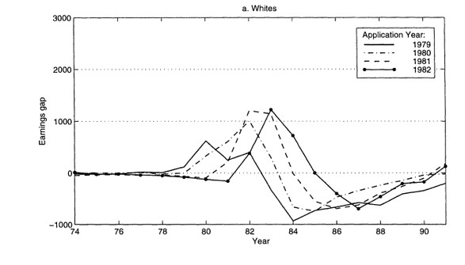
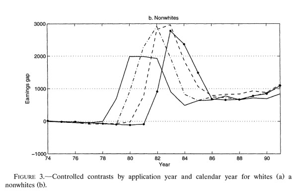

---
format:
  revealjs:
    theme: ["./theme-ic.scss"]
    width: 1600
    height: 900
    slide-number: c/t
    center: false
    scrollable: false
    title-slide: false
    logo: logo-CIDE.jpg
    footer: "Inferencia Causal · Selección por Observables"
    include-in-header:
      - _ic-header.html
      - fontawesome.html
---


```{r}
#| label: setup
#| include: false
knitr::opts_chunk$set(echo = FALSE, fig.path = "figures/")

library(tidyverse)
library(janitor)
library(sandwich)
#library(nnet)
#library(mlogit)
library(readr)
library(clubSandwich)
library(modelsummary)
library(estimatr)
library(haven)
library(MatchIt)
library(cobalt)
library(lmtest)
library(kableExtra)


xfun::pkg_load2(c('base64enc', 'htmltools', 'mime'))
```


# Selección por Observables {.portada background-color="#163D34" data-state="nochrome"}

::: {.pa-eyebrow}
Inferencia Causal
:::

[Irvin Rojas]{.pa-name} <span class="pa-icons"><a href="https://github.com/rojasirvin" target="_blank" aria-label="GitHub"><i class="bi bi-github"></i></a> <a href="https://scholar.google.com/citations?hl=es&user=FUwdSTMAAAAJ&view_op=list_works&sortby=pubdate" target="_blank" aria-label="Google Scholar"><i class="bi bi-mortarboard-fill"></i></a> <a href="mailto:irvin.rojas@cide.edu" aria-label="Correo"><i class="bi bi-envelope-fill"></i></a></span>

::: {.pa-inst}
Centro de Investigación y Docencia Económicas<br>Maestría en Economía
:::
```{css}
.huge .remark-code { /*Change made here*/
  font-size: 200% !important;
}
.tiny .remark-code { /*Change made here*/
  font-size: 60% !important;
}
/* Láminas con código y salida de R más grandes que el .7em del tema; mismo
   tamaño en todas, con interlineado y márgenes más compactos para que quepan */
.reveal .codigo-grande div.sourceCode pre code.sourceCode { font-size: 1.3em !important; line-height: 1.4; }
.reveal .codigo-grande .cell-output pre code { font-size: 1.3em; line-height: 1.25; padding: .45em 1.1em; }
.reveal .codigo-grande pre, .reveal .codigo-grande div.sourceCode { margin: .25em 0 .45em; }
/* Salida larga de R (22 coeficientes): más grande que el .7em del tema, pero
   sin llegar al tamaño de .codigo-grande para que quepa en una lámina */
.reveal .salida-mediana .cell-output pre code { font-size: .95em; line-height: 1.2; }
/* Salida muy larga (summary de matchit): letra más grande dentro de un recuadro
   con scroll vertical, en lugar de encogerla para que quepa */
.reveal .salida-scroll .cell-output pre { max-height: 560px; overflow-y: auto; border: 1px solid var(--line); border-radius: 10px; }
.reveal .salida-scroll .cell-output pre code { font-size: 1.3em; line-height: 1.3; max-height: none !important; overflow: visible !important; border: 0; }
/* Tabla de balance junto a su código: más chica para que quepa en media lámina */
.reveal .tabla-compacta table { font-size: .62em; }
/* El tema centra verticalmente las columnas; aquí arrancan al mismo nivel */
.reveal .columnas-arriba .columns { align-items: flex-start; }
/* El tema limita los scroll_box a 560px; esta lámina solo tiene la tabla */
.reveal .tabla-alta div[style*="overflow-y"] { max-height: 770px !important; }
```

# Selección por Observables {.divider background-color="#9B2247" data-state="nochrome"}


## Motivación

- Hemos estudiado la conveniencia de los experimentos para revelar relaciones causales

- También hemos destacado las limitaciones de los diseños experimentales

- Algunos métodos nos permiten usar datos observacionales y supuestos estadísticos para estimar relaciones causales en ausencia de variación experimental

- Los métodos basados en selección en observables dieron origen a una literatura extensa en economía en la década de los 2000, sin embargo, su aplicación actual como método de inferencia principal es muy limitada

- En cambio, los fundamentos de los métodos basados en observables son piezas clave en métodos modernos de inferencia causal que usan *machine learning* o los conocidos como *estimadores doblemente robustos*


## Organización de lo que cubriremos en el curso

1. Supuesto de independencia condicional
1. Métodos de *matching*
   - *Matching* basado en covariables
   - *Propensity score matching*
1. Otros métodos basados en el SIC
   - Regresión
   - Métodos locales
   - *Inverse probability weighting*
   - Métodos doblemente robustos


## Recordatorio del sesgo de selección
 
- Las razones que determinan la asignación del tratamiento determinan también el valor de $Y$

- Una comparación observacional nos da el efecto del tratamiento más el sesgo de selección:

$$
\begin{aligned}
E(Y|D=1)-E(Y|D=0)=&\overbrace{ E(Y(1)|D=1)-E(Y(0)|D=1)}^{\Delta_{TOT}\text{: efecto promedio en los tratados}}+\\& \underbrace{E(Y(0)|D=1)-E(Y(0)|D=0)}_{\text{Sesgo de selección}}
\end{aligned}
$$

- Una forma de eliminar el sesgo de selección es mediante la asignación aleatoria del tratamiento

- Esto no siempre es posible, por lo que recurrimos a supuestos estadísticos
 


## Supuesto de independencia condicional

- **Supuesto 1. Independencia condicional (SIC)**: condicional en una serie de características $X$, los resultados potenciales son independientes del tratamiento

$$\{Y(0),Y(1)\}\perp D | X$$

- El SIC también se conoce como inconfundibilidad, ignorabilidad del tratamiento o *unconfoundedness*


## Supuesto de independencia condicional

- El SIC dice que al *controlar* por una serie de características $X$, el tratamiento es *como* si fuera aleatorio:

$$
E(Y(1)|D=1,X)=E(Y(1)|D=0,X)
$$

$$
E(Y(0)|D=1,X)=E(Y(0)|D=0,X)
$$

- Los valores esperados de $Y(1)$ y $Y(0)$ son iguales cuando nos fijamos en cada valor de $X$


## Ejemplo: ir a la universidad

- Supongamos que $D$ es ir o no a la universidad y la variable de interés es el ingreso

- Sabemos que la comparación estará contaminada por el sesgo de selección

- Es posible que aquellos que fueron a la universidad de todos modos hubieran tenido un mayor salario, incluso sin haber ido a la universidad, por lo que el sesgo de selección es positivo

- El SIC implica que si hacemos la comparación condicional en $X$, el sesgo de selección desaparece

$$
E(Y|D=1,X)-E(Y|D=0,X)=E(Y(1)-Y(0)|X)
$$

- Es decir, que si comparamos a personas con y sin tratamiento, con los $X$ *fijos*, el sesgo de selección desaparece

- *Mantener fijas* las $X$ es el análogo a obtener el promedio del salario en cada nivel de escolaridad en la gráfica de la FEC


## Ejemplo: ir a la universidad

- Para generalizar el concepto cuando la variable tiene más de dos valores (como con la educación $S$), escribamos $Y(s)$ para el ingreso potencial con $s$ años de educación

- Esta función nos dice cuál sería el ingreso de un individuo bajo todos los posibles niveles de $s$

- En este caso, asumimos el SIC, que se traduce en: 
$$Y(s)\perp S | X\quad \forall\quad s$$

- En diseños experimentales, descansamos en el supuesto de independencia de los resultados potenciales con respecto al estatus de tratamiento

- Pero con datos *observacionales*, el SIC significa que $S$ es *casi como si fuera asignado de manera aleatoria* cuando condicionamos en $X$

## Ejemplo: ir a la universidad

- En los datos solo observamos $Y=Y(S)$

- Dado el SIC, podemos hacer comparaciones de ingreso promedio para distintos niveles de educación:

$$E(Y|S=s,X)-E(Y|S=s-1,X)=E(Y(s)-Y(s-1)|X)$$

- Notemos que lo impráctico de esto es que tendríamos que hacer comparaciones en pares y luego tratar de hacer un promedio ponderado por el número de individuos en cada nivel de educación


## Regresión para hacer las comparaciones

- Supongamos una función causal para el ingreso

$$Y(s)=\alpha+\rho s+\nu$$

que indica lo que un individuo ganaría para todo valor de $s$ (y no solo el valor realizado $S$)

- La única parte aleatoria es el error con media cero $\nu$, que captura los factores no observados que afectan los ingresos

- Sustituyendo el valor observado:

$$Y=\alpha+\rho S+\nu$$

- $S$ puede estar correlacionado con los resultados potenciales $Y(s)$, es decir, correlacionado con el error $\nu$


## Regresión para hacer las comparaciones

- Supongamos que el SIC se cumple dado un vector $X$

- Descompongamos el error en una función lineal de las características $X$ y un error $u$:

$$\nu=X'\gamma+u$$

donde se asume que $E(\nu|X)=X'\gamma$ y donde $u$ y $X$ no están correlacionados

- Si se cumple el SIC, entonces:

$$
\begin{aligned}
E(Y(s)|X,S)=E(Y(s)|X)&=\alpha+\rho s+E(\nu|X) \\
&=\alpha+\rho s + X'\gamma
\end{aligned}
$$

- Es decir, en el modelo de regresión causal $Y=\alpha+\rho S+ X'\gamma+u$, $u$ no está correlacionado con los regresores $X$ y $S$

- $\rho$ es el efecto causal de interés

- El supuesto clave es que la única razón por la cual $\nu$ y $S$ están correlacionados es $X$

## Supuesto de soporte común

- **Supuesto 2. Soporte común**: para cualquier combinación de covariables en la población, existen individuos tratados y no tratados

$$0<p(X)<1$$

donde $p(X)=\Pr(D=1|X)$ es la probabilidad condicional de recibir el tratamiento o *propensity score (PS)*

- El soporte común descarta que haya covariables que predigan determinísticamente la asignación de tratamiento


## Supuestos de identificación del TOT
 
- Cuando se cumple **Supuesto 1** $+$ **Supuesto 2**  se conoce como **ignorabilidad fuerte**
  
- Heckman, Ichimura y Todd (1998) muestran que estas condiciones son demasiado estrictas si nos interesa estimar solo el TOT
  
- Para identificar el TOT es suficiente:
    
- **Supuesto 1a. Inconfundibilidad en el control**

$$
Y(0) \perp  D | X
$$

- **Supuesto 2a. Traslape débil**

$$
p(X) < 1
$$


# Matching exacto {.divider background-color="#9B2247" data-state="nochrome"}

## Matching exacto
 
- Un estimador de matching exacto consiste en *emparejar* individuos tratados y no tratados para cada valor específico de las $X$ y estimar un promedio ponderado de las diferencias
  
- Tenemos datos observacionales de individuos que recibieron y no recibieron un tratamiento y tenemos una serie de características $X$

- Bajo el SIC, podemos eliminar el sesgo de selección al estimar las diferencias de $Y$ dentro de grupos con las mismas $X$

- Requerimos que existan observaciones tratadas y no tratadas para todas las características $X$


## Ejemplo: programa hipotético de empleo

- Usemos [el ejemplo](https://mixtape.scunning.com/matching-and-subclassification.html?panelset=r-code) en The Mixtape (MT):

```{r}

read_data <- function(df) {
  full_path <- paste(
    "https://raw.github.com/scunning1975/mixtape/master/",
    df,
    sep = ""
  )
  df <- read_dta(full_path)
  return(df)
}

training_example <- read_data("training_example.dta") |>
  slice(1:20)

data.treat <- training_example |>
  select(unit_treat, age_treat, earnings_treat) |>
  slice(1:10) |>
  mutate(earnings_treat = as.numeric(earnings_treat))

data.control <- training_example |>
  select(unit_control, age_control, earnings_control)

data.matched <- training_example |>
  select(unit_matched, age_matched, earnings_matched) |>
  slice(1:10)
```

## Ejemplo: programa hipotético de empleo {.codigo-grande .columnas-arriba}


:::: {.columns}

::: {.column width="50%"}

- Los individuos tratados:

```{r}
data.treat
```
:::

::: {.column width="50%"}

- Mientras que los no tratados:
  
```{r}
data.control
```
:::

::::


## Comparación observacional {.codigo-grande}

- Si hiciéramos diferencias simples obtendríamos:

```{r}
#| echo: true
#| message: false
#| warning: false
mean(data.treat$earnings_treat)
mean(data.control$earnings_control)

#Diferencia
mean(data.treat$earnings_treat) - mean(data.control$earnings_control)
```

- Parece que en el grupo de control ganan más (efecto de tratamiento negativo)

## Comparación observacional {.codigo-grande}

- El principal problema con esta diferencia es que sabemos que los ingresos crecen con la edad

- La muestra de no tratados tiene mayor edad promedio:

```{r}
#| echo: true
#| message: false
#| warning: false
mean(data.treat$age_treat)
mean(data.control$age_control)

#Diferencia
mean(data.treat$age_treat) - mean(data.control$age_control)
```

- Estamos *confundiendo* el efecto de la edad


## Muestra emparejada

- Construyamos la muestra emparejada buscando, para cada individuo en el grupo tratado, uno en el de control que tenga la misma edad. Cuando le encontramos un individuo no tratado al tratado con la misma edad decimos que esa pareja hizo *match*

- Por ejemplo, la primera unidad tratada, con 18 años y un ingreso de 9,500 estaría emparejada con la unidad 14 del grupo de control, que tiene también 18 años y un ingreso de 8,050

- Para dicho individuo de 18 años, su ingreso contrafactual sería 8,050

- Cuando hay varias unidades en el grupo de control que pueden ser empatadas con la de tratamiento, podemos construir el ingreso contrafactual calculando el promedio

- Del grupo de control, los individuos 10 y 18 tienen 30 años, con ingresos 10,750 y 9,000, por lo que usamos el promedio (9,875) para crear el contrafactual del individuo tratado de 30 años de la fila 10

## Muestra emparejada {.codigo-grande}

- La muestra emparejada o contrafactual será:

```{r}
#| output-location: column

data.matched
```

## Muestra emparejada {.codigo-grande}

- Noten que la edad es la misma entre los tratados y la muestra emparejada:


:::: {.columns}

::: {.column width="50%"}

- Muestra de tratados:

```{r}
#| echo: true
mean(data.treat$age_treat)
```

:::

::: {.column width="50%"}

- Muestra emparejada:

```{r}
#| echo: true
mean(data.matched$age_matched)
```
:::

::::


- En este caso, decimos que la edad *está balanceada*

- Y entonces podemos calcular el efecto de tratamiento como la diferencia de ingresos entre los tratados y los no tratados en la muestra emparejada:

```{r}
#Diferencia
mean(data.treat$earnings_treat) - mean(data.matched$earnings_matched)
```

- En este caso, encontramos un efecto positivo del programa de 1,695 unidades monetarias.

## Estimador de matching exacto

- Podemos definir un **estimador de matching exacto** del TOT basado en una sola característica como:

$$\hat{\Delta}_{TOT}=\frac{1}{n_1}\sum_{i:D_i=1}\left(Y_i-\frac{1}{M_i}\sum_{m=1}^{M_i}Y_{j_m(i)}\right)$$

donde $n_1$ es el número de tratados, $M_i$ es el número de no tratados con $X_j=X_i$ y $j_m(i)$ es el $m$-ésimo de ellos

## Importancia del soporte común

- Observemos lo que ocurre con la distribución de edades en ambos grupos:


:::: {.columns}

::: {.column width="50%"}

Para los tratados:

```{r}
#| label: grafica_tratados
#| fig-height: 5
ggplot(training_example, aes(x = age_treat)) +
  stat_bin(bins = 10, na.rm = TRUE)
```

:::

::: {.column width="50%"}

- Mientras que para los no tratados:

```{r}
#| label: grafica_notratados
#| fig-height: 5
ggplot(training_example, aes(x = age_control)) +
  geom_histogram(bins = 10, na.rm = TRUE)
```
:::

::::

- El supuesto de traslape débil para identificar el TOT significa que para cada unidad tratada, hay al menos un no tratado


## Estimador de matching exacto del ATE

- Hasta aquí, solo hemos imputado el contrafactual para cada unidad en el grupo tratado

- Si podemos imputar también, para cada unidad no tratada, su correspondiente contrafactual tratado, podemos estimar el ATE

- Y un **estimador de matching exacto** del ATE sería:


$$\hat{\Delta}_{ATE}=\frac{1}{n}\sum_{i=1}^{n}(2D_i-1)\left(Y_i-\frac{1}{M_i}\sum_{m=1}^{M_i}Y_{j_m(i)}\right)$$

donde ahora $j_m(i)$ recorre las $M_i$ unidades del grupo *opuesto* al de $i$ con $X_j=X_i$

- Casi todas las aplicaciones de *matching* se enfocan en el TOT

## *Matching* con más de una característica

- En general, tenemos varias características en $X$

- Pensamos en $X$ más como una *celda* de individuos que comparten las mismas características

- Tenemos que tener una regla para definir la distancia mínima entre dos vectores de covariables $X_i$ y $X_j$

- Un **estimador de vecino más cercano** es:

$$\hat{\Delta}_{TOT}=\frac{1}{n_1}\sum_{i:D_i=1}\left(Y_i-\sum_{j:D_j=0}\mathbb{I}\left\{||X_j-X_i||=\min_{l:D_l=0}||X_l-X_i||\right\} Y_j\right)$$

## Decisiones en el *matching*

- ¿Realizar el *matching* con o sin reemplazo?[^1]

[^1]: La discusión en *Causal Analysis (CA)* asume *matching con reemplazo*. 

- Sin reemplazo:
  - Reduce la varianza en la estimación al usar un grupo no tratado más grande en lugar de reusar observaciones
  - Incrementa el sesgo pues algunos *matches* no podrán hacerse dado que algunas observaciones no tratadas ya han sido descartadas

- ¿Cómo medir la distancia entre las covariables?
  - Euclidiana: $||X_j-X_i||_{Euclidiana}=\sqrt{\sum_{k=1}^{K}(X_{jk}-X_{ik})^2}$
  - Varianza: $||X_j-X_i||_{Varianza}=\sqrt{\sum_{k=1}^{K}\frac{(X_{jk}-X_{ik})^2}{\hat{Var}(X_k)}}$
  - Mahalanobis: $||X_j-X_i||_{Mahalanobis}=\sqrt{(X_j-X_i)'\hat{\Sigma}_X^{-1}(X_j-X_i)}$, con $\hat{\Sigma}_X$ la matriz de varianzas y covarianzas de $X$

## Decisiones en el *matching*

- ¿Cómo estimar la varianza?
  - Abadie e Imbens (2008) mostraron analíticamente que el bootstrap no es apropiado en el contexto de *matching*
  - Sin embargo, otros estudios de simulación han mostrado que funciona en muchas aplicaciones de *matching* y se llega a usar en casos particulares (por ejemplo, cuando el *matching* se realiza con reemplazo)
  - El consejo práctico es usar resultados analíticos cuando estos estén disponibles


## Ejemplo: veteranos del ejército de Estados Unidos

- Angrist (1998)[^angrist] estudia el efecto del servicio militar sobre los ingresos (inscribirse en el ejército tiene un claro componente de autoselección)

[^angrist]: [Estimating the Labor Market Impact of Voluntary Military Service Using Social Security Data on Military Applicants](https://www.jstor.org/stable/2998558).

- El autor tiene datos $X$: raza, año de solicitud de ingreso al ejército, escolaridad, calificación en examen de aptitud, año de nacimiento
  
- Estas características definen *celdas* y dentro de cada celda tenemos tratados y no tratados

- Se estiman los efectos usando distintas metodologías

- Los impactos estimados usando el matching exacto se encuentran bajo la columna *Contraste controlado*

## Ejemplo: veteranos del ejército de Estados Unidos {.tabla-alta}

```{r}
#| label: table.angrist
#| echo: false
#| message: false
#| warning: false
#| results: asis

anio <- 74:91

# Blancos: media (1), diferencia de medias (2), contraste controlado (3) y regresión (4)
media.b <- c("182.7", "237.9", "473.4", "1012.9", "2147.1", "3560.7", "4709.0", "6226.0", "7200.6", "8398.1", "9874.2", "10972.7", "12004.5", "13045.7", "14136.1", "14716.1", "14886.1", "14407.9")
dif.b <- c("-26.1", "-41.4", "-47.9", "-7.1", "40.3", "188.0", "572.9", "855.5", "1508.5", "1390.5", "652.8", "469.8", "543.7", "663.9", "904.3", "1169.1", "1300.8", "1559.6")
dif.b.ee <- c("(7.0)", "(6.3)", "(8.1)", "(11.3)", "(16.7)", "(21.0)", "(23.4)", "(27.2)", "(30.3)", "(34.4)", "(39.5)", "(44.6)", "(50.4)", "(54.6)", "(58.3)", "(61.0)", "(63.0)", "(64.6)")
cc.b <- c("-14.0", "-14.2", "-14.8", "-8.6", "-23.5", "-8.4", "178.0", "249.5", "783.3", "588.8", "-235.7", "-521.3", "-557.3", "-548.0", "-415.5", "-248.6", "-154.5", "29.8")
cc.b.ee <- c("(9.2)", "(7.6)", "(9.0)", "(12.3)", "(18.1)", "(23.2)", "(27.2)", "(32.4)", "(36.4)", "(41.1)", "(46.9)", "(52.6)", "(59.0)", "(63.9)", "(68.2)", "(71.2)", "(73.6)", "(75.6)")
reg.b <- c("-13.0", "-12.0", "-12.7", "-9.4", "-22.4", "-11.2", "175.9", "249.9", "782.4", "601.5", "-198.5", "-459.6", "-491.7", "-464.3", "-311.7", "-136.3", "-53.2", "146.2")
reg.b.ee <- c("(9.4)", "(7.8)", "(9.3)", "(12.2)", "(17.2)", "(21.6)", "(24.6)", "(29.1)", "(32.5)", "(36.6)", "(41.7)", "(46.8)", "(52.5)", "(56.8)", "(60.6)", "(63.2)", "(65.2)", "(66.9)")

# No blancos: media (5), diferencia de medias (6), contraste controlado (7) y regresión (8)
media.n <- c("157.2", "216.9", "413.6", "820.9", "1677.9", "2797.0", "3932.2", "5218.8", "6150.2", "7221.1", "8377.2", "9306.8", "10106.2", "10833.0", "11480.1", "11751.4", "11904.3", "11518.7")
dif.n <- c("-4.9", "-0.6", "-14.5", "-13.0", "58.1", "340.3", "1154.3", "1920.0", "2917.1", "2889.9", "2202.9", "1955.5", "1881.3", "2050.1", "2175.0", "2379.1", "2483.6", "2758.8")
dif.n.ee <- c("(4.4)", "(4.5)", "(6.4)", "(9.1)", "(13.4)", "(16.2)", "(18.0)", "(20.7)", "(23.4)", "(27.0)", "(30.5)", "(34.4)", "(38.7)", "(41.8)", "(44.9)", "(47.6)", "(49.4)", "(50.8)")
cc.n <- c("-2.0", "-17.1", "-33.3", "-56.0", "-53.6", "119.1", "741.6", "1299.9", "2186.0", "2103.8", "1333.0", "932.3", "720.9", "751.0", "708.2", "799.7", "824.9", "1026.1")
cc.n.ee <- c("(6.0)", "(6.0)", "(8.0)", "(11.1)", "(16.1)", "(20.1)", "(23.4)", "(28.2)", "(32.0)", "(36.7)", "(41.4)", "(46.2)", "(51.2)", "(55.2)", "(59.5)", "(62.7)", "(65.4)", "(67.2)")
reg.n <- c("-3.9", "-15.2", "-30.2", "-51.3", "-42.5", "122.3", "738.5", "1318.5", "2210.1", "2142.3", "1428.9", "1059.2", "872.3", "925.0", "923.7", "1031.9", "1064.0", "1277.9")
reg.n.ee <- c("(5.8)", "(5.5)", "(7.4)", "(10.0)", "(14.1)", "(17.2)", "(19.5)", "(23.1)", "(26.0)", "(29.8)", "(33.4)", "(37.3)", "(41.6)", "(44.8)", "(48.1)", "(50.9)", "(52.7)", "(54.3)")

# Cada año ocupa dos filas: el estimador y, debajo, su error estándar
vacio <- rep(" ", length(anio))

table.angrist <- data.frame(
  anio = c(rbind(anio, vacio)),
  media.b = c(rbind(media.b, vacio)),
  dif.b = c(rbind(dif.b, dif.b.ee)),
  cc.b = c(rbind(cc.b, cc.b.ee)),
  reg.b = c(rbind(reg.b, reg.b.ee)),
  media.n = c(rbind(media.n, vacio)),
  dif.n = c(rbind(dif.n, dif.n.ee)),
  cc.n = c(rbind(cc.n, cc.n.ee)),
  reg.n = c(rbind(reg.n, reg.n.ee))
)

colnames(table.angrist) <- c(
  "Año",
  "Media<br>(1)", "Diferencia de medias<br>(2)", "Contraste controlado<br>(3)", "Regresión<br>(4)",
  "Media<br>(5)", "Diferencia de medias<br>(6)", "Contraste controlado<br>(7)", "Regresión<br>(8)"
)

table.angrist |>
  kbl(align = "lcccccccc",
      escape = FALSE) |>
  kable_paper(c("hover", "condensed", "responsive")) |>
  # scroll_box fija el encabezado y le pone un blanco inline que pisa el guinda
  # del CSS; lo reponemos aquí, igual que en la tabla de causalidad.qmd.
  row_spec(0, background = "#9B2247", color = "white") |>
  add_header_above(c(" " = 1, "Blancos" = 4, "No blancos" = 4),
                   bold = TRUE,
                   background = "white") |>
  add_header_above(c("Estimaciones alternativas del efecto del servicio militar en los ingresos" = 9),
                   bold = TRUE,
                   background = "white") |>
  footnote(general = "Panel A de la Tabla II en Angrist (1998). Errores estándar entre paréntesis.",
           general_title = "Nota:",
           footnote_as_chunk = T) |>
  scroll_box(height = "700px")
```


## Ejemplo: veteranos del ejército de Estados Unidos

- Noten que la columna (2) muestra lo que se hubiera concluido si solo se comparan diferencias de medias
    
- Antes de 1980, las diferencias eran muy pequeñas (cero en términos prácticos)
  
- En esta aplicación esta comparación llevaría a conclusiones incorrectas
  
- Además, las diferencias para no-blancos y blancos son distintas
  
- Hay un pico en los efectos alrededor de 1982
  
- En esta aplicación, los resultados por *matching* y regresión son muy parecidos hasta 1984
  
- La conclusión es que existe evidencia de efectos negativos en los ingresos por haber servido en el ejército en los blancos y efectos positivos para los individuos de otras razas


## Ejemplo: veteranos del ejército de Estados Unidos {.columnas-arriba}


:::: {.columns}

::: {.column width="50%"}

- Para personas identificadas como blancas:

```{r}
#| echo: false
#| out-width: "100%"

```

:::

::: {.column width="50%"}

- Para personas identificadas como no blancas:

```{r}
#| echo: false
#| out-width: "100%"

```
:::

::::


# Propensity Score Matching {.divider background-color="#9B2247" data-state="nochrome"}

## Maldición de la dimensionalidad
 
- En la práctica es difícil manejar problemas en espacios de múltiples dimensiones: **maldición de la dimensionalidad**
 
- El problema de la maldición de la dimensionalidad se exacerba con el tamaño limitado de las bases de datos
 
- Si $X$ tuviera $K$ indicadores binarios, el número de posibles combinaciones sería $2^K$
   
- Por ejemplo, si solo tuviéramos $X_1=\{\text{menor de 35 años}, \text{con 35 años o más}\}$, $X_2=\{\text{más que preparatoria}, \text{menos que preparatoria}\}$, $X_3=\{\text{indígena}, \text{no indígena}\}$, tendríamos que hacer ocho comparaciones:
   
  - menor de 35 años, más que preparatoria, indígena
  - menor de 35 años, más que preparatoria, no indígena
  - ...
  - con 35 años o más, menos que preparatoria, no indígena

- Pero si $X$ incluye muchas variables, algunas tomando muchos valores, esto se vuelve imposible de realizar
  

## Maldición de la dimensionalidad

- El requerimiento de soporte común significa que debemos tener tratados y no tratados para cada valor de $X$ para hacer comparaciones

- Cuando $X$ tiene muchas dimensiones, resulta un problema de *escasez* o *sparseness*

- Algunas celdas estarán vacías, o solo tendrán tratados, o solo tendrán no tratados

- Si tenemos unidades no tratadas en cada celda donde hay tratados, **aún podemos estimar el TOT**

  - Noten que cuando completamos la muestra emparejada en el ejemplo hipotético, siempre encontramos a alguien en el grupo de control para asignárselo a un tratado
  
  - Pero al revés, no siempre es posible: por ejemplo, no hay ningún tratado de 48 años en nuestro ejemplo hipotético


## Teorema del *propensity score* (Rosenbaum y Rubin, 1983)
 
- **Teorema 1. Inconfundibilidad dado el propensity score**: el **Supuesto 1** implica
 
$$
\{Y(0), Y(1)\} \perp  D|p(X)
$$
 
donde $p(X)=\Pr(D=1|X)$ es la probabilidad de ser tratado dado un conjunto de covariables $X$, el *propensity score* o PS
 
- El efecto del tratamiento, bajo el supuesto de inconfundibilidad dado el propensity score, es:
   
$$\Delta_{TOT}=E\left(\mu_1(p(X))-\mu_0(p(X))|D=1\right)$$

donde $\mu_d(p(X))=E(Y|D=d,p(X))$

## Estimación
 
- Debemos primero especificar y estimar el PS (probit o logit son los métodos más comunes)
 
- Se realiza el *match* de unidades tratadas con unidades que no lo fueron usando el PS

- Se comprueba la calidad del *matching*

- Se estima la diferencia en la variable de resultados entre estos grupos, así como su error estándar
   

## Estimación del modelo del PS
 
- Se usa un modelo *probit* o *logit*

- Se deben seleccionar las características incluidas en el modelo 
 
- **Prueba y error**: maximizar la tasa de clasificación de tratamientos y controles usando $\bar{p}$, la proporción de tratamientos en la muestra

- **Significancia estadística**: usar solo las variables estadísticamente significativas, comenzando con un modelo muy básico

- **Validación cruzada**: comenzar con un modelo simple y agregar grupos de variables comparando las que reduzcan el error cuadrático promedio

## Estimación del modelo del PS

- Las características usadas para calcular el PS no deben haber sido afectadas por el tratamiento
 
- Idealmente usamos variables $X$ pre-intervención
 
- Cuando no hay $X$ pre-intervención, a veces se puede obtener el PS con variables post-intervención siempre y cuando estas no hayan sido afectadas por el tratamiento (pocas veces recomendado)

## Algoritmos de *matching*

- **Vecino más cercano**: a cada individuo del grupo tratado se le asigna el individuo del grupo no tratado con el PS más cercano
 
- **$M$ vecinos más cercanos**: a cada individuo del grupo tratado se le asignan los $M$ individuos del grupo no tratado con el PS más cercano (*ratio* en R define el número de vecinos)

- El método de vecinos más cercanos puede generar malos emparejamientos si los vecinos más cercanos están muy lejos en términos del PS
  
- **Vecino más cercano con caliper**: consiste en definir una vecindad aceptable de matching (el *caliper*) y elegir solo el vecino más cercano dentro del caliper

- **$M$ vecinos más cercanos con caliper**: consiste en hacer *match* con $M$ individuos dentro del *caliper*

## Algoritmos de *matching*

- **Radio**: todos los no tratados dentro del caliper son usados para hacer *match*

- **Estratificación**: parte la región de soporte común en bloques de acuerdo al PS, estima el efecto de tratamiento dentro de cada bloque y, posiblemente, agrega los efectos de acuerdo con la distribución del PS

- **Kernel**: todas las unidades no tratadas son usadas para hacer *match*, pesándolas apropiadamente con unos pesos que decaen conforme a la distancia en términos del PS (reduce la varianza, pero incrementa el sesgo)

- Y muchos otros: **genético**, **cardinal**, **óptimo**, **completo**, etc.

- No hay un método claramente superior a todos los demás
 
- Puede hacerse con reemplazo o sin reemplazo
 
- Se recomienda mostrar la robustez respecto a las decisiones tomadas


 


## Calidad del *matching*

- Para estimar el TOT se requiere que se cumpla el soporte común, por lo que se debe verificar el traslape del PS calculado para los tratados y no tratados
 
- Otro de los teoremas de Rosenbaum y Rubin (1983) implica que

$$
X \perp  D|p(X)
$$
 
- Esto es, que al controlar por el PS, las variables $X$ no deben proveer información sobre $D$
   
- Se recomienda también hacer una prueba de estratificación

  1. Dividir el rango del soporte común en bloques 
 
  1. Hacer una prueba de medias del PS entre grupos dentro de cada bloque
 
  1. Hacer una prueba de medias de cada variable en $X$ entre grupos dentro de cada bloque


## Estimación del TOT e inferencia estadística

- Con la muestra emparejada, procedemos a estimar el efecto del tratamiento y su error estándar

- Existe una gran variedad de formas de proceder, así como de críticas a las formas en que otros lo hacen

- La primera edición de MT usaba métodos de simulación basados en el paquete *Zelig* (ya descontinuado)

- En CA se propone usar bootstrap para tomar en cuenta la etapa de estimación del PS usando el paquete *Matching*

- Para nuestra práctica, usaremos el paquete [*MatchIt*](https://kosukeimai.github.io/MatchIt/index.html), con un enfoque de regresión o *g-computation* para estimar los efectos

 
## Conclusión sobre el PSM

- El uso del PSM requiere de supuestos teóricos fuertes

- La implementación implica que las variables en $X$ son aquellas que permiten asumir la inconfundibilidad dado el PS

- Hay una gran cantidad de decisiones en el proceso de estimación

- La crítica más importante es que la mayoría de las veces nos preocupa más la autoselección basada en no observables que en observables

- Pero muchas veces es todo lo que tenemos a la mano

- Hacer análisis de sensibilidad a las distintas decisiones y presentar resultados transparentes 
 

# Regresión {.divider background-color="#9B2247" data-state="nochrome"}

## Regresión

- Dados unos datos observacionales y asumiendo SIC, ¿por qué no usar directamente las herramientas de regresión que ya conocemos para estimar efectos causales?

**Definiciones**

- **Efecto Promedio Condicional del Tratamiento (CATE)**: es el efecto promedio de tratamiento bajo la condición de que los individuos tienen el mismo valor $X=x$

$$
\begin{align*}
\Delta_x&=E(Y(1)|X=x)-E(Y(0)|X=x) \\
&=\mu_1(x)-\mu_0(x)
\end{align*}
$$

- Si *promediamos* el CATE sobre todos los valores de $X=x$, obtenemos el ATE:

$$\Delta_{ATE} = E(\mu_1(X)-\mu_0(X))$$

- Y si nos fijamos solo en el subconjunto de la población que fue tratado, obtenemos el TOT:

$$\Delta_{TOT} = E(\mu_1(X)|D=1)-E(\mu_0(X)|D=1)$$

## Regresión lineal

- Bajo el SIC, podríamos pensar que podemos estimar $\mu_D(X)$ usando una regresión de la forma:
$$\mu_D(X)=\alpha+\beta_DD+\beta_{X_1}X_1+\ldots+\beta_{X_K}X_K$$

**Problemas**

- $D$ y $X$ están correlacionados, lo cual afecta la varianza de $\hat{\beta}_D$ (tenemos menos información nueva que si $D$ y $X$ fueran independientes)

- El modelo puede estar mal especificado
  - Omitimos términos de grado mayor que uno
  - Omitimos posibles interacciones entre covariables ($X_1 X_2$)
  - Omitimos posibles interacciones entre el tratamiento, las covariables y sus posibles términos de orden mayor que uno

## Regresión con interacciones y términos de orden alto

- Pensaríamos que podemos arreglar el segundo problema con
$$
\begin{align*}
\mu_D(X) &= \alpha + \beta_D D + \beta_{X_1}X_1 + \ldots + \beta_{X_K}X_K + \beta_{D,X_1}DX_1 + \ldots + \beta_{D,X_K}DX_K \\
&\quad + \beta_{X_1^2}X_1^2+\ldots+\beta_{X_1,X_2}X_1X_2+\ldots
\end{align*}
$$

- Y con los coeficientes estimados podríamos obtener $\hat{\mu}_D(X)$ y calcular

$$\hat{\Delta}_{ATE}^R=\frac{1}{n}\sum_{i=1}^{n}(\hat{\mu}_1(X_i)-\hat{\mu}_0(X_i))$$
$$\hat{\Delta}_{TOT}^R=\frac{1}{n_1}\sum_{i:D_i=1}(\hat{\mu}_1(X_i)-\hat{\mu}_0(X_i))$$

**Problemas**

- ¿Cómo determinar óptimamente el orden de los polinomios y el número de interacciones?

- *Trade-off* sesgo vs varianza

## *Trade-off* sesgo vs varianza {.columnas-arriba}

- El error cuadrático medio de $\hat{\mu}_d(x)$ como estimador de $\mu_d(x)$ se descompone en dos partes:

$$
E\left((\hat{\mu}_d(x)-\mu_d(x))^2\right)=\underbrace{\left(E(\hat{\mu}_d(x))-\mu_d(x)\right)^2}_{\text{Sesgo}^2}+\underbrace{Var(\hat{\mu}_d(x))}_{\text{Varianza}}
$$

:::: {.columns}

::: {.column width="45%"}

- Un modelo **rígido** (pocos términos) no sigue la forma de $\mu_d(x)$: sesgo alto y varianza baja

- Un modelo **flexible** (muchos términos) sigue de cerca los datos: sesgo bajo y varianza alta

- Reducir un componente suele aumentar el otro

:::

::: {.column width="55%"}

```{r}
#| label: sesgo_varianza
#| fig-width: 8
#| fig-height: 4.6
#| out-width: "100%"

# Datos simulados con media condicional no lineal y tres polinomios de
# distinto grado: uno rígido, uno intermedio y uno demasiado flexible
set.seed(820)

datos.sv <- data.frame(x = runif(40, 0, 1)) |>
  mutate(y = sin(2 * pi * x) + rnorm(40, sd = 0.4))

malla.sv <- data.frame(x = seq(0.02, 0.98, length.out = 200))

grados <- c(1, 4, 15)
etiquetas <- c("Grado 1: sesgo alto", "Grado 4", "Grado 15: varianza alta")
ajustes.sv <- list()

for (g in seq_along(grados)) {
  modelo <- lm(y ~ poly(x, grados[g]), data = datos.sv)
  ajustes.sv[[g]] <- malla.sv |>
    mutate(ajuste = predict(modelo, newdata = malla.sv),
           modelo = etiquetas[g])
}

ajustes.sv <- bind_rows(ajustes.sv) |>
  mutate(modelo = factor(modelo, levels = etiquetas))

ggplot(datos.sv, aes(x = x, y = y)) +
  geom_point(color = "grey50") +
  stat_function(fun = function(x) sin(2 * pi * x), linetype = "dashed") +
  geom_line(data = ajustes.sv, aes(y = ajuste), color = "#9B2247", linewidth = 1) +
  facet_wrap(~modelo) +
  scale_x_continuous(breaks = c(0, 0.5, 1), labels = c("0", "0.5", "1")) +
  coord_cartesian(ylim = c(-2, 2)) +
  labs(x = "X", y = "Y",
       caption = "Línea punteada: media condicional verdadera") +
  theme_minimal(base_size = 16)
```

:::

::::


## Métodos locales 

- Estimamos la media condicional para cada valor de $X=x$ como la media local de observaciones con $X$ cercanos a $x$

$$\hat{\mu}_{d,h}(x)=\frac{\sum_{i:D_i=d}\mathcal{K}\left(\frac{X_i-x}{h}\right) Y_i}{\sum_{i:D_i=d}\mathcal{K}\left(\frac{X_i-x}{h}\right)}$$

  donde $\mathcal{K}(\cdot)$ es la función *kernel* que otorga pesos más grandes a las observaciones con $\frac{X_i-x}{h}$ cercano a cero y pesos más pequeños (incluso cero) para valores más lejanos de cero, y $h$ es el *ancho de banda*

## Pesos kernel

- Algunos ejemplos de pesos kernel son los siguientes, con $u=\frac{X_i-x}{h}$:

```{r}
data.frame(
  kernel = c("Uniforme",
             "Triangular",
             "Epanechnikov",
             "Cuártico (<em>biweight</em>)",
             "Gaussiano"),
  peso = c("\\(\\frac{1}{2}\\,\\mathbb{I}\\{\\lvert u\\rvert\\leq 1\\}\\)",
           "\\((1-\\lvert u\\rvert)\\,\\mathbb{I}\\{\\lvert u\\rvert\\leq 1\\}\\)",
           "\\(\\frac{3}{4}(1-u^2)\\,\\mathbb{I}\\{\\lvert u\\rvert\\leq 1\\}\\)",
           "\\(\\frac{15}{16}(1-u^2)^2\\,\\mathbb{I}\\{\\lvert u\\rvert\\leq 1\\}\\)",
           "\\(\\frac{1}{\\sqrt{2\\pi}}\\exp\\left(-\\frac{u^2}{2}\\right)\\)")
) |>
  kbl(col.names = c("Kernel", "\\(\\mathcal{K}(u)\\)"),
      align = "cc",
      escape = FALSE) |>
  kable_paper(c("hover", "condensed", "responsive"),
              full_width = FALSE)
```


## Elección de $h$

- La elección de $h$ es clave en la estimación
  - Un $h$ grande conlleva más sesgo pues se otorga un peso más grande a observaciones con $X_i$ lejano de $x$
  - Un $h$ pequeño conlleva una mayor varianza pues solo otorga pesos a unas cuantas observaciones[^overfitting]

[^overfitting]: A este problema se le conoce como *sobreajuste* u *overfitting*. La idea es que, con un $h$ muy pequeño, cada media local se calcula con muy pocas observaciones, por lo que $\hat{\mu}$ reproduce el ruido de la muestra con la que se estimó y no la media condicional. En otras palabras, la media condicional ajusta muy bien dentro de la muestra, pero predice mal observaciones nuevas. Por eso la validación cruzada evalúa el error en la observación $i$ que se dejó fuera.

- Se suele escoger un $h_{opt}$ usando un procedimiento de *validación cruzada* o  *cross-validation*

$$h_{opt}=\text{arg} \min_{h \in \mathcal{H}} \sum_{i:D_i=d}(Y_i-\hat{\mu}_{d,-i,h}(X_i))^2$$

donde $\hat{\mu}_{d,-i,h}(X_i)$ es la media condicional estimada para la observación $i$, dejando fuera a $i$ y usando el resto de la muestra para la estimación

## Elección de $h$

- El proceso de validación cruzada consiste en variar $h$ hasta encontrar el valor que minimice la suma de los errores de predicción

- Una vez obtenido $h_{opt}$ calculamos $\hat{\mu}_{d,h_{opt}}(X_i)$

- Esta es una forma comúnmente usada en el trabajo aplicado para estimar medias condicionales


# *Inverse probability weighting* {.divider background-color="#9B2247" data-state="nochrome"}

## *Inverse probability weighting (IPW)*

- Es otra manera de explotar el PS para estimar el efecto causal, dado que se cumpla el SIC

- La idea es usar el inverso del PS como pesos
  - Las observaciones subrepresentadas en su grupo (tratados con PS bajo, no tratados con PS alto) reciben más peso
  - Las observaciones sobrerrepresentadas en su grupo (tratados con PS alto, no tratados con PS bajo) reciben menos peso

- La intuición es que al repesar las observaciones, los grupos tratado y no tratado son comparables en términos de la distribución de sus $X$

## Motivación del IPW con un experimento[^santanna]

- Pensemos en un experimento simple, donde $\{Y(0),Y(1)\} \perp D$ y solo decidimos la proporción de unidades que serán tratadas

- Estimamos el ATE con la diferencia de medias entre tratados y no tratados, que podemos reescribir como:

$$
\begin{align*}
\hat{\Delta}_{ATE}^{E}&=\frac{1}{n_1}\sum_{i:D_i=1}Y_i-\frac{1}{n_0}\sum_{i:D_i=0}Y_i \\
&=\frac{\sum_{i=1}^n D_iY_i}{\sum_{j=1}^n D_j}-\frac{\sum_{i=1}^n (1-D_i)Y_i}{\sum_{j=1}^n (1-D_j)} \\
&=\frac{1}{n}\sum_{i=1}^n \frac{D_i}{\hat{p}}Y_i-\frac{1}{n}\sum_{i=1}^n \frac{1-D_i}{1-\hat{p}}Y_i
\end{align*}
$$

donde $\hat{p}=\frac{1}{n}\sum_{i=1}^n D_i=\frac{n_1}{n}$ es la proporción de unidades tratadas

[^santanna]: Adaptado de [Sant'Anna, Econ 520](https://psantanna.com/Econ520/Slides/15-ipw/15slides.html#12)

## Motivación del IPW con un experimento

- Es decir, en un experimento simple, el estimador de diferencia de medias del ATE es un promedio ponderado de los resultados:

$$
\hat{\Delta}_{ATE}^{E}=\frac{1}{n}\sum_{i=1}^n \left(\frac{D_i}{\hat{p}}-\frac{1-D_i}{1-\hat{p}}\right)Y_i
$$

- Los pesos son el inverso del PS, que en este diseño es una constante

- Cada grupo es pesado por el inverso de la probabilidad de pertenecer a ese grupo

- Podemos seguir usando la misma lógica reemplazando $\hat{p}$ por $\hat{p}(X_i)$, siempre que haya soporte común, $0<p(X)<1$

## Estimadores de IPW

- Bajo esta lógica, dos estimadores de IPW son:

$$\hat{\Delta}_{ATE}^{IPW}=\left(\sum_{i=1}^n \frac{Y_i D_i}{\hat{p}(X_i)} / \sum_{i=1}^n \frac{D_i}{\hat{p}(X_i)}\right) - \left(\sum_{i=1}^n \frac{Y_i (1-D_i)}{1-\hat{p}(X_i)} / \sum_{i=1}^n \frac{1-D_i}{1-\hat{p}(X_i)}\right)$$ 

$$\hat{\Delta}_{TOT}^{IPW}=\left(\sum_{i=1}^n Y_i D_i / \sum_{i=1}^n D_i\right) - \left(\sum_{i=1}^n \frac{Y_i (1-D_i)\hat{p}(X_i)}{1-\hat{p}(X_i)} / \sum_{i=1}^n \frac{(1-D_i)\hat{p}(X_i)}{1-\hat{p}(X_i)}\right)$$

- En el TOT, los tratados reciben un peso de uno y los no tratados se pesan por $\frac{\hat{p}(X_i)}{1-\hat{p}(X_i)}$, de forma que la distribución de sus $X$ se parezca a la de los tratados


# Métodos doblemente robustos {.divider background-color="#9B2247" data-state="nochrome"}

## *Métodos doblemente robustos (DR)*

- Estos métodos consisten en usar lo mejor de los dos mundos vistos anteriormente: estimación de medias condicionales y pesos basados en el PS

- Los parámetros de interés son:

$$\Delta_{ATE}=E\left(\mu_1(X)-\mu_0(X)+ \frac{(Y-\mu_1(X))D}{p(X)}-\frac{(Y-\mu_0(X))(1-D)}{1-p(X)}\right)$$
$$\Delta_{TOT}=E\left(\frac{(Y-\mu_0(X))D}{\Pr(D=1)}-\frac{(Y-\mu_0(X))(1-D)p(X)}{(1-p(X))\Pr(D=1)}\right)$$

- Puede verificarse que, bajo el SIC y el soporte común, estas expresiones son equivalentes a las que definen $\Delta_{ATE}$ y $\Delta_{TOT}$ con medias condicionales (regresión) y con pesos basados en el PS (IPW)

- La ventaja es que basta con que especifiquemos bien el modelo para la media condicional o el modelo del PS para estimar de forma consistente los efectos de tratamiento
  - Regresión requiere que el modelo de la media condicional sea correcto
  - IPW requiere que el modelo del PS sea correcto

## Estimadores DR

- Usamos estimadores *plug-in*, es decir, calculamos cada parte por separado y los *conectamos*[^facure]

- Estimamos $\hat{\mu}_1(X)$ y $\hat{\mu}_0(X)$ con una regresión y $\hat{p}(X)$ con un modelo para el PS

- El estimador DR del ATE es:

$$
\begin{align*}
\hat{\Delta}_{ATE}^{DR}&=\frac{1}{n}\sum_{i=1}^n\left(\hat{\mu}_1(X_i)+\frac{D_i(Y_i-\hat{\mu}_1(X_i))}{\hat{p}(X_i)}\right) -\frac{1}{n}\sum_{i=1}^n\left(\hat{\mu}_0(X_i)+\frac{(1-D_i)(Y_i-\hat{\mu}_0(X_i))}{1-\hat{p}(X_i)}\right)
\end{align*}
$$

- Y el estimador DR del TOT, usando $\widehat{\Pr}(D=1)=\frac{n_1}{n}$, es:

$$
\hat{\Delta}_{TOT}^{DR}=\frac{1}{n_1}\sum_{i=1}^n\left(D_i-\frac{(1-D_i)\hat{p}(X_i)}{1-\hat{p}(X_i)}\right)(Y_i-\hat{\mu}_0(X_i))
$$

- En el TOT solo necesitamos $\hat{\mu}_0(X)$, pues el contrafactual que falta es el de los tratados sin tratamiento

[^facure]: Adaptado de [Facure, *Causal Inference for the Brave and True*, capítulo 12](https://matheusfacure.github.io/python-causality-handbook/12-Doubly-Robust-Estimation.html)


## Inferencia para regresión, IPW y DR

- Usamos errores robustos en el caso de la estimación paramétrica

- Usamos bootstrap para la estimación local con kernel

- Usamos errores estándar analíticos que toman en cuenta la estimación del PS en el caso de IPW y DR

# Anexo 1: ejemplos de algoritmos de *matching* basados en el PS {.divider background-color="#9B2247" data-state="nochrome"}

```{r}
# Tabla de dos columnas con el PS estimado de cada unidad de un grupo, para
# los ejemplos de este anexo
tabla_ps <- function(grupo, unidad, ps) {
  tabla <- data.frame(unidad, ps)
  colnames(tabla) <- c(grupo, "\\(\\hat{p}\\)")

  tabla |>
    kbl(align = "cc",
        escape = FALSE) |>
    kable_paper(c("hover", "condensed", "responsive"),
                full_width = FALSE)
}
```

## Vecino más cercano

:::: {.columns}

::: {.column width="50%"}

```{r}
tabla_ps("Tratados",
         c("a", "b", "c", "\\(\\vdots\\)"),
         c("0.031", "0.042", "0.07", "\\(\\vdots\\)"))
```

:::

::: {.column width="50%"}

```{r}
tabla_ps("No tratados",
         c("A", "B", "C", "\\(\\vdots\\)"),
         c("0.034", "0.068", "0.21", "\\(\\vdots\\)"))
```

:::

::::

- Con vecino más cercano, el individuo $a$ tratado estaría emparejado con el $A$ no tratado

- Si el emparejamiento es con reemplazo, $A$ podría ser usado otra vez y $b$ también sería emparejado con $A$

- Pero si el emparejamiento es sin reemplazo, $A$ ya no puede ser usado y a $b$ se le emparejaría con $B$

- Cuando hacemos el emparejamiento sin reemplazo, debemos tener una muestra lo suficientemente grande

- El emparejamiento sin reemplazo depende del orden en que se realice el procedimiento


## Vecino más cercano con caliper

:::: {.columns}

::: {.column width="50%"}

```{r}
tabla_ps("Tratados",
         c("a", "b", "c", "d", "\\(\\vdots\\)"),
         c("0.031", "0.042", "0.07", "0.11", "\\(\\vdots\\)"))
```

:::

::: {.column width="50%"}

```{r}
tabla_ps("No tratados",
         c("A", "B", "C", "D", "\\(\\vdots\\)"),
         c("0.034", "0.068", "0.21", "0.40", "\\(\\vdots\\)"))
```

:::

::::

- El primer paso es fijar el caliper, por ejemplo, de 0.1

- El caliper implica buscar al vecino más cercano dentro de una vecindad de 0.1

- En este ejemplo $d$ se emparejaría con $B$ si $B$ aún está disponible (porque no ha sido emparejado con nadie o porque, aunque haya sido emparejado, el procedimiento se hace con reemplazo)

- $D$ queda fuera del caliper y nunca se usa 


## $M$ vecinos más cercanos con caliper

:::: {.columns}

::: {.column width="50%"}

```{r}
tabla_ps("Tratados",
         c("d", "e", "f", "g", "h", "i", "\\(\\vdots\\)"),
         c("0.31", "0.39", "0.44", "0.52", "0.55", "0.62", "\\(\\vdots\\)"))
```

:::

::: {.column width="50%"}

```{r}
tabla_ps("No tratados",
         c("R", "S", "T", "U", "V", "W", "\\(\\vdots\\)"),
         c("0.27", "0.29", "0.33", "0.49", "0.57", "0.61", "\\(\\vdots\\)"))
```

:::

::::

- Si se utiliza un caliper de 0.1 y dos vecinos, a $g$ se le asignarían $U$ y $V$ (si estuvieran disponibles)

- Es decir, dentro del caliper, los dos individuos con el PS más cercano


## Radio

:::: {.columns}

::: {.column width="50%"}

```{r}
tabla_ps("Tratados",
         c("d", "e", "f", "g", "h", "i", "\\(\\vdots\\)"),
         c("0.31", "0.39", "0.44", "0.52", "0.55", "0.62", "\\(\\vdots\\)"))
```

:::

::: {.column width="50%"}

```{r}
tabla_ps("No tratados",
         c("R", "S", "T", "U", "V", "W", "\\(\\vdots\\)"),
         c("0.27", "0.29", "0.33", "0.49", "0.57", "0.61", "\\(\\vdots\\)"))
```

:::

::::

- Pero si ahora implementamos radio con un caliper de 0.1, a $g$ se le asignarían $U$, $V$ y $W$ (si estuvieran disponibles)

- Es decir, todos los individuos dentro del caliper


## Kernel

:::: {.columns}

::: {.column width="50%"}

```{r}
tabla_ps("Tratados",
         c("d", "e", "f", "g", "h", "i"),
         c("0.31", "0.39", "0.44", "0.52", "0.55", "0.62"))
```

:::

::: {.column width="50%"}

```{r}
tabla_ps("No tratados",
         c("R", "S", "T", "U", "V", "W"),
         c("0.27", "0.29", "0.33", "0.49", "0.57", "0.61"))
```

:::

::::

- Supongamos que estos son todos nuestros datos

- Con un emparejamiento por kernel, a $d$ lo *emparejamos* con todos los individuos, desde $R$ hasta $W$

- La función kernel le dará más peso a $T$ y $S$, un poco menos a $R$ y así hasta darle muy poco o casi nada de peso a $W$


# Anexo 2: PSM en R {.divider background-color="#9B2247" data-state="nochrome"}

## Efecto de fumar en el embarazo

- Datos en [cattaneo_smoking.csv](cattaneo_smoking.csv) (Cattaneo, 2010) de una muestra de mujeres que incluye un indicador de si la madre fumó durante el embarazo

- Buscamos estimar el efecto de fumar sobre el peso de los bebés al nacer

- Se incluyen una serie de covariables que usaremos para modelar el PS

- Usaremos los paquetes *MatchIt* y *cobalt*

## *matchit* para realizar los emparejamientos {.codigo-grande}

- Usaremos *matchit* de la librería *MatchIt* para hacer el emparejamiento

- Construimos la dummy de tratamiento (**smoke**), una dummy para mujeres casadas (**married**) y una dummy para si el caso en cuestión es el primer bebé (**firstbaby**)

```{r}
#| echo: true

data.smoking<-read_csv(
  "./cattaneo_smoking.csv",
  locale = locale(encoding = "latin1")) |>
  clean_names() |>
  mutate(smoke=ifelse(mbsmoke=="smoker",1,0)) |>
  mutate(married=ifelse(mmarried=="married",1,0)) |>
  mutate(firstbaby=ifelse(fbaby=="Yes",1,0))

#Asegurarse que no hay NA, matchit no acepta NA
data.smoking <- data.smoking[complete.cases(data.smoking), ]

#Una semilla para todo el trabajo
set.seed(1021)
```


## Comparación observacional {.codigo-grande .tabla-compacta}

- Si solo comparamos a las mujeres que fuman con las que no fuman, estamos comparando personas muy diferentes


```{r}
#| echo: true
#| output-location: column

datasummary_balance(~smoke,
                    fmt = "%.2f",
                    data = select(data.smoking, smoke, 
                                  married, firstbaby, 
                                  medu, nprenatal, 
                                  foreign, mhisp, fage),
                    dinm_statistic = "p.value",
                    title = "Pruebas de balance",
                    notes = "Fuente: Cattaneo (2010)")
```


## Estimación del PS {.codigo-grande}

- Una manera de hacer más eficiente el uso de las *fórmulas* es usando *as.formula*

```{r}
#| echo: true

binaria <- "smoke"
variables <- c("married", "firstbaby", "medu", "nprenatal", "foreign", "mhisp", "fage")

ps <- as.formula(paste(binaria, paste(variables, collapse = "+"), sep = " ~ "))
print(ps)
```

- Usamos *matchit* para estimar el PS y realizar los emparejamientos con el algoritmo que indiquemos:

```{r}
#| echo: true

m.out <- matchit(formula=ps,
                 method = "nearest",
                 ratio = 1,
                 distance= "glm",
                 link = "logit",
                 replace = FALSE,
                 estimand = "ATT",
                 data = data.smoking)
 
```

## Estimación del PS {.codigo-grande .salida-scroll}

- El resumen del procedimiento da bastante información sobre el *matching*

```{r}
#| echo: true

summary(m.out)
```


## Verificación del balance {.codigo-grande .columnas-arriba}


:::: {.columns}

::: {.column width="50%"}

Gráfico de nube:

```{r}
#| echo: true

plot(m.out, type = "jitter", interactive = FALSE)
```


:::

::: {.column width="50%"}

Histograma:

```{r}
#| echo: true

plot(m.out, type = "hist")
```


:::

::::


## Muestra emparejada {.codigo-grande}

- Podemos guardar un objeto con la muestra emparejada usando *match.data* y observar quién hace match con quién

```{r}
#| echo: true
#| output-location: column

m.data <- match.data(m.out)

head(m.out$match.matrix)
```


## Calidad del *matching*

- Se sugiere evaluar las diferencias promedio estandarizadas (SMD) entre los grupos tratados y no tratados, antes y después del emparejamiento

- Para el TOT, *matchit* divide entre la desviación estándar del grupo tratado, $S_T$

$$SMD_X=\frac{\bar{X}_T-\bar{X}_{NT}}{S_T}$$
    
- También se sugiere calcular la razón de varianzas (VR). Se espera que este ratio no sea muy distinto de 1 después de hacer el emparejamiento
    
$$VR=\frac{S^2_T}{S^2_{NT}}$$

- **Regla de dedo**: una diferencia de 0.1 o menos en el SMD se considera un buen balance. Por ejemplo, la escolaridad de la madre tenía un SMD de -0.5955 en la muestra en bruto, pero con el emparejamiento el SMD se vuelve de solo 0.0171

## *Loveplot* {.codigo-grande}

- Usando la librería *cobalt* podemos construir un *love plot* que representa gráficamente las diferencias antes y después del emparejamiento

```{r}
#| echo: true
#| output-location: column
love.plot(bal.tab(m.out),
          threshold = .1)
```


## Efecto de tratamiento {.codigo-grande}

- Han existido muchas maneras de explotar la muestra emparejada. Aquí usamos *g-computation*

- Una buena guía sobre la estimación de los efectos está en la documentación de [MatchIt](https://kosukeimai.github.io/MatchIt/articles/estimating-effects.html)

- Estimamos un modelo para la variable dependiente dado el tratamiento y, opcionalmente, las covariables, usando la muestra emparejada

```{r}
#| echo: true
tt1 <- lm(bweight ~ smoke,
          data = m.data,
          weights = weights)

```

## Efecto de tratamiento {.codigo-grande}

- Usamos `marginaleffects::avg_comparisons()` para estimar el TOT

- *vcov* indica que se estimen errores agrupados a nivel pareja, que es lo apropiado cuando el emparejamiento es sin reemplazo ([Abadie & Spiess, 2022](https://doi.org/10.1080/01621459.2020.1840383))

- *newdata* indica que se genere un nuevo objeto de datos con solo las unidades tratadas para estimar el TOT

```{r}
#| echo: true

tot.psm <- marginaleffects::avg_comparisons(tt1,
                variables = "smoke",
                vcov = ~subclass,
                newdata = subset(smoke == 1))
tot.psm
```

## Efecto de tratamiento {.codigo-grande}

Algunos autores incluyen las covariables en su estimación:

```{r}
#| echo: true

tt2 <- lm(bweight ~ smoke*(married + firstbaby + medu + nprenatal + foreign + mhisp + fage),
          data = m.data,
          weights = weights)

#Errores agrupados a nivel subclass
marginaleffects::avg_comparisons(tt2,
                variables = "smoke",
                vcov = ~subclass,
                newdata = subset(smoke == 1))
```


# Anexo 3: regresión, IPW y DR en R {.divider background-color="#9B2247" data-state="nochrome"}


## Regresión, IPW y DR: fumar durante el embarazo

- Comparamos los distintos métodos para estimar el TOT con los datos de Cattaneo (2010)

- $D$ es **smoke**, $Y$ es **bweight** y $X$ son las mismas siete covariables que usamos para estimar el PS

- Veremos cuatro estimadores:
  - Regresión paramétrica, con *lm* y *avg_comparisons* del paquete *marginaleffects*
  - Regresión kernel, con *npreg* del paquete *np* y solo tres de las covariables
  - IPW, con *PSweight* del paquete *PSweight*
  - DR, también con *PSweight*

- En IPW y DR el PS se estima con el mismo logit que en el PSM, guardado en la fórmula **ps**

## Regresión paramétrica {.codigo-grande}

- Estimamos una regresión con interacciones entre $D$ y todas las covariables

- *avg_comparisons*, del paquete *marginaleffects*, promedia $\hat{\mu}_1(X_i)-\hat{\mu}_0(X_i)$ sobre los tratados, que es $\hat{\Delta}_{TOT}^R$:

```{r}
#| label: ejemplo_regresion
#| echo: true
#| message: false
library(marginaleffects)

# Regresión con interacciones entre D y X
ols <- lm(bweight ~ smoke * (married + firstbaby + medu + nprenatal +
                               foreign + mhisp + fage),
                               data = data.smoking)

# Promedio de las diferencias predichas en la muestra de tratados
tot.reg <- avg_comparisons(ols, variables = "smoke", vcov = "HC1",
                           newdata = filter(data.smoking, smoke == 1))
c(efecto = tot.reg$estimate, ee = tot.reg$std.error)
```

## Regresión kernel {.codigo-grande}

- Con siete covariables, la media local sufre de la maldición de la dimensionalidad, por lo que usamos solo tres: **married**, **fage** y **nprenatal**

```{r}
#| include: false
options(np.messages = FALSE)
```

```{r}
#| label: ejemplo_kernel
#| echo: true
#| message: false
#| results: hold
library(np)

tratados <- filter(data.smoking, smoke == 1)
notratados <- filter(data.smoking, smoke == 0)

# h óptimo de cada covariable por validación cruzada, solo con los no tratados
bw <- npregbw(bweight ~ married + fage + nprenatal, data = notratados,
              regtype = "lc", bwmethod = "cv.ls", ckertype = "epanechnikov")

# Media local de los no tratados, evaluada en las X de cada tratado
mu0 <- predict(npreg(bw), newdata = tratados)
mean(tratados$bweight - mu0)
```

## Regresión kernel {.columnas-arriba}

:::: {.columns}

::: {.column width="45%"}

- *regtype = "lc"*: es la media local constante; con varias covariables, el peso es el producto de los kernels de cada una

- *bwmethod = "cv.ls"*: es la validación cruzada que deja fuera a cada observación

- Hay un $h_{opt}$ por covariable: `r round(bw$bw[1], 2)` para **married**, `r round(bw$bw[2], 1)` para **fage** y `r round(bw$bw[3], 2)` para **nprenatal**

- $\hat{\mu}_0$ se estima solo con los no tratados y da el contrafactual de cada tratado

- El TOT estimado es de `r round(mean(tratados$bweight - mu0), 1)` gramos

- Obtenemos el error estándar usando bootstrap

:::

::: {.column width="55%"}

```{r}
#| label: kernel_mu0
#| fig-width: 8
#| fig-height: 5.5
#| out-width: "100%"
#| warning: false

# Media local estimada de los no tratados según las visitas prenatales y el
# estado civil, con la edad del padre en su mediana
malla.x <- expand.grid(married = c(0, 1),
                       fage = median(notratados$fage),
                       nprenatal = 0:20)
malla.x$mu0 <- predict(npreg(bw), newdata = malla.x)
malla.x$estado <- ifelse(malla.x$married == 1, "Casada", "No casada")

ggplot(malla.x, aes(x = nprenatal, y = mu0, color = estado)) +
  geom_line(linewidth = 1.2) +
  scale_color_manual(values = c("Casada" = "#163D34", "No casada" = "#9B2247"),
                     name = NULL) +
  labs(x = "Visitas prenatales", y = "Peso al nacer (gramos)",
       caption = "Media local estimada con los no tratados") +
  theme_minimal(base_size = 16) +
  theme(legend.position = "top")
```

:::

::::

## Regresión kernel: inferencia {.codigo-grande}

- *boot*, del paquete *boot*, repite el estimador en cada muestra bootstrap, manteniendo fijos los $h_{opt}$

```{r}
#| label: kernel_bootstrap
#| echo: true
#| message: false
library(boot)

covs <- c("married", "fage", "nprenatal")

bs <- function(data, indices) {
  dat <- data[indices, ]                 # muestra bootstrap
  tr <- filter(dat, smoke == 1)
  nt <- filter(dat, smoke == 0)
  mu0 <- npreg(bws = bw$bw, txdat = nt[, covs], tydat = nt$bweight,
               exdat = tr[, covs], regtype = "lc", ckertype = "epanechnikov")$mean
  mean(tr$bweight - mu0)                 # TOT en la muestra bootstrap
}

set.seed(1021)
boot.kernel <- boot(data = data.smoking, statistic = bs, R = 499)
c(efecto = boot.kernel$t0, ee = sd(boot.kernel$t))
```

## IPW {.codigo-grande}

- *weight = "treated"* pide los pesos del TOT (1 para los tratados y $\frac{\hat{p}(X_i)}{1-\hat{p}(X_i)}$ para los no tratados)

```{r}
#| label: ejemplo_ipw
#| echo: true
#| message: false
library(PSweight)

ipw <- PSweight(ps.formula = ps,
                yname = "bweight",
                data = as.data.frame(data.smoking),
                weight = "treated")

summary(ipw)$estimates
```

## DR {.codigo-grande}

- Agregamos un modelo para $Y$ (*out.formula*) y pedimos el estimador aumentado (*augmentation = TRUE*)

```{r}
#| label: ejemplo_dr
#| echo: true
resultado <- as.formula(paste("bweight",
                              paste(variables, collapse = "+"),
                              sep = " ~ "))

dr <- PSweight(ps.formula = ps,
               yname = "bweight",
               data = as.data.frame(data.smoking),
               weight = "treated",
               augmentation = TRUE,
               out.formula = resultado)

summary(dr)$estimates
```

## Comparación entre métodos

```{r}
dif.simple <- lm(bweight ~ smoke, data = data.smoking)

data.frame(
  metodo = c("Diferencia simple de medias",
             "PSM (vecino más cercano, sin reemplazo)",
             "Regresión paramétrica",
             "Regresión kernel (tres covariables)",
             "IPW",
             "DR"),
  efecto = c(coef(dif.simple)["smoke"],
             tot.psm$estimate,
             tot.reg$estimate,
             mean(tratados$bweight - mu0),
             summary(ipw)$estimates[1, "Estimate"],
             summary(dr)$estimates[1, "Estimate"]),
  ee = c(coeftest(dif.simple, vcov. = vcovHC, type = "HC1")["smoke", 2],
         tot.psm$std.error,
         tot.reg$std.error,
         sd(boot.kernel$t),
         summary(ipw)$estimates[1, "Std.Error"],
         summary(dr)$estimates[1, "Std.Error"])
) |>
  mutate(efecto = sprintf("%.1f", efecto),
         ee = ifelse(is.na(ee), "—", sprintf("%.1f", ee))) |>
  kbl(col.names = c("Método", "Efecto en el peso al nacer (gramos)", "Error estándar"),
      align = "lcc") |>
  kable_paper(c("hover", "condensed", "responsive"),
              full_width = FALSE)
```

- Todos los métodos estiman el TOT con las mismas covariables, salvo la regresión kernel, que usa tres: fumar durante el embarazo reduce el peso al nacer en alrededor de 200 gramos

- La diferencia simple de medias exagera el efecto, pues las madres que fuman difieren de las que no fuman en características que también afectan el peso al nacer

- Todos descansan en el SIC: si hay selección en no observables, ninguno la corrige


# Selección por Observables {.final background-color="#9B2247" data-state="nochrome"}

::: {.f-eyebrow}
Inferencia Causal
:::

::: {.f-inst}
[Irvin Rojas](https://rojasirvin.github.io/)
:::

::: {.f-inst}
CIDE · Maestría en Economía
:::

<span class="f-icons"><a href="https://github.com/rojasirvin" target="_blank" aria-label="GitHub"><i class="bi bi-github"></i></a> <a href="https://scholar.google.com/citations?hl=es&user=FUwdSTMAAAAJ&view_op=list_works&sortby=pubdate" target="_blank" aria-label="Google Scholar"><i class="bi bi-mortarboard-fill"></i></a> <a href="mailto:irvin.rojas@cide.edu" aria-label="Correo"><i class="bi bi-envelope-fill"></i></a></span>

::: {.f-rule}
:::

::: {.f-copy}
© 2026 Irvin Rojas. Distribuido bajo licencia Creative Commons **CC BY-NC-SA 4.0**. Los materiales de terceros citados conservan sus propios derechos.
:::
